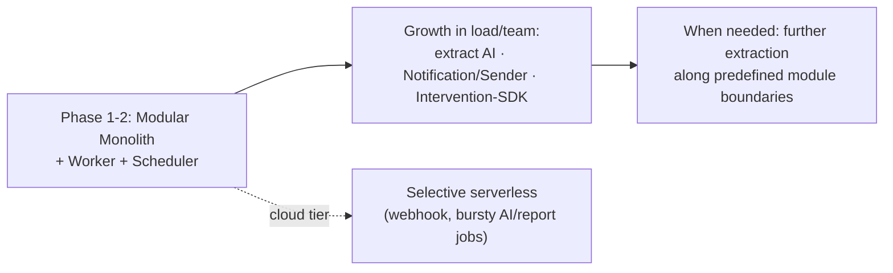

# DigiShield — Architecture Decision Records (ADR)

> A log of important architectural decisions. Each ADR records: Context → Decision → Consequences → Alternatives Considered → Review Conditions.

---

## ADR-001 — Deployment architecture style: Modular Monolith oriented toward gradual extraction

- **Status:** Accepted
- **Date:** 27/06/2026
- **Related:** `DigiShield_Technical_Design.md` (Ch.1, Ch.19), `DigiShield_MultiTenant_Implementation_Guide.md`

### Context

DigiShield is at the specification/MVP stage, with a small team, serving 3 segments with very different requirements:
- **Government Agencies:** mandatory **on-premise / air-gapped** deployment, data kept in-country.
- **Enterprises & Schools:** run on cloud (multi-tenant).

The workload has two distinct rhythms:
- *Synchronous, low-latency, high-availability:* web app/API, **transaction intervention SDK**, real-time WebSocket alerts.
- *Asynchronous, bursty:* bulk email/SMS sending, LLM calls, risk-score recalculation, scheduled campaigns.

We need to choose an architecture style that balances development speed, operating cost, and the ability to deploy to both cloud and on-prem.

### Decision

1. **The core is a Modular Monolith** — a single deployment unit, but divided into **internal modules with clear boundaries** matching the future services exactly: Auth, Learning, Simulation, Reporting, Analytics, Notification, AI, Tenancy/Billing. Modules communicate through internal interfaces; cross-module table access is forbidden.
2. **Separate asynchronous Workers from the start** — same codebase, different processes: API process + Worker pool + Scheduler, connected via a Message Queue. This is the minimum requirement regardless of architecture style.
3. **Package with containers (K8s/Helm)** so it can run on both cloud and on-prem/air-gapped.
4. **Do NOT use managed serverless (FaaS) as the core** — because it cannot be deployed in air-gapped environments and does not suit WebSocket/long-running jobs. Serverless is only used *selectively at the cloud tier* for bursty tasks, and there is always a standard worker alternative for the on-prem build.
5. **Split into microservices on demand (strangler pattern)** — only extract parts with their own rhythm/SLA/scale when genuinely needed (see roadmap).

### Evolution Roadmap

Priority order for extraction (when needed): **AI Service** (scales with LLM call volume), **Notification/Sender** (bursty email/SMS), **Intervention/SDK** (requires SLA & high availability, independent of the rest).

### Consequences

**Positive:**
- Fast development, one pipeline, one deployment; easy to debug and simple internal transactions.
- Runs on both cloud and on-prem/air-gapped → serves the government sector.
- Clear module boundaries make later microservice extraction less painful.

**Negative / to be controlled:**
- No independent per-part scaling yet → compensated by separating workers and scaling horizontally per process.
- Risk of a "tangled monolith" if module boundaries are loose → architectural discipline is mandatory: no cross-table calls, each module exposes an interface, dependency checks in CI (e.g., ArchUnit/eslint-boundaries).
- The "microservice" statement in the initial TDD needs to be revised to "modular monolith oriented toward gradual extraction."

### Alternatives Considered

| Alternative | Why not chosen |
|---|---|
| Full microservices immediately | Too early for a small team/MVP; operating cost (mesh, distributed transactions, observability) is not yet justified. Still the *destination* for the hot paths. |
| Pure serverless (FaaS) | Cannot run air-gapped (gov); poorly suited to WebSocket/long-running jobs; hard on-prem. Used only as a supplement on cloud. |
| **Modular monolith + worker (chosen)** | Balances speed, cost, and on-prem capability; preserves the evolution path to microservices. |

### Review Conditions for This ADR

Revisit when any of these signs appear: the development team exceeds ~3 groups needing independent deployment; a module (e.g., AI or Sender) becomes a scale/latency bottleneck; the monolith's build/test time becomes too long; or a separate SLA is required for the intervention SDK.

---

## ADR-002 — Backend stack: Java 21 (LTS) + Spring Boot + Spring Modulith

- **Status:** Accepted (revised — see "Runtime Java version" below)
- **Date:** 27/06/2026
- **Related:** ADR-001, `DigiShield_Architecture_Deploy_CICD.md`

### Context

We need to finalize the backend language/framework. Key constraints & needs: **Vietnamese government/enterprise** customers (preference for the Java ecosystem, on-prem/air-gapped), a **modular monolith oriented toward gradual extraction** architecture (ADR-001), strong requirements for **SSO/SAML/OAuth/SCIM**, **bulk sending**, and **high concurrency** (WebSocket, intervention SDK).

### Decision

The backend uses **Java 21 (LTS) + Spring Boot 3.5.x + Spring Modulith 1.4.x**, with:
- **Spring Modulith** — realizes the modular monolith: module boundaries are automatically verified, communication via events, easy microservice extraction later (matches ADR-001).
- **Spring Security** — JWT, RBAC, SSO SAML/OAuth, SCIM.
- **Spring Batch** — campaigns & bulk email/SMS sending.
- **Hibernate multi-tenancy + PostgreSQL RLS** (`SET LOCAL app.tenant_id`); **Flyway** for multi-tenant migration.
- **Virtual threads (Project Loom)** enabled by default — high concurrency in synchronous style, no need for reactive.
- **Spring AI** — LLM integration. **Gradle** build; optional **GraalVM native image** for small on-prem builds.
- **Frontend** remains React/TypeScript (kept separate, using OpenAPI to generate the client).

### Consequences

**Positive:** easily accepted by the government sector & easy to hire for; Modulith matches the chosen architecture exactly; security/SSO/batch are available and mature; Loom handles concurrency neatly; runs anywhere with a JVM (cloud & on-prem).

**Negative / to be controlled:** the JVM uses more memory than Node → reduced with Loom + AppCDS + (optional) native image; FE/BE use different languages → compensated by generating the client from OpenAPI; JVM startup time → CDS/native for sensitive environments.

### Alternatives Considered

| Alternative | Why not chosen |
|---|---|
| Node.js + NestJS | Good for a pure JS/TS team wanting a shared language with the FE; but weaker on-prem acceptance in the government sector and on enterprise SSO/Batch maturity. |
| Go | Small footprint, fast; but a less rich enterprise SSO/Batch/ORM ecosystem, fewer engineers in Vietnam. |
| Quarkus/Micronaut | Lightweight & fast startup; smaller community/talent pool than Spring. |
| **Java 21 + Spring Boot + Modulith (chosen)** | The best balance for the Vietnamese gov/enterprise context + the ADR-001 architecture, on a fully-supported, stable toolchain. |

### Runtime Java version — Java 21 LTS (revision)

This ADR originally targeted **Java 25**. During implementation we moved the build/runtime to **Java 21 (LTS)** for toolchain stability:

- **Ecosystem support.** Java 25 (GA 9/2025) is only supported by **Spring Boot ≥ 3.5.5 / Boot 4.0** and **Gradle ≥ 9.1**. Building on Java 25 with the pinned toolchain (Spring Boot 3.5.x + Gradle 8.x) fails at component scanning — Spring's bundled ASM cannot read class-file major version 69 (`Unsupported class file major version 69`).
- **No functional loss.** The codebase uses no Java 25-only language features; virtual threads (Project Loom), records, pattern matching, etc. are all available on Java 21. There is no runtime benefit to Java 25 for this project today.
- **Stable, supported combo.** **Java 21 LTS + Spring Boot 3.5.5 + Spring Modulith 1.4.1 + Gradle 8.5** is an officially supported, low-risk combination that builds and runs as-is.

The source remains forward-compatible: adopting Java 25 later only requires bumping the Gradle wrapper to ≥ 9.1 and (optionally) Spring Boot to 4.0, then raising the toolchain `languageVersion` back to 25.

### Review Conditions

Revisit if: the core team is not Java; an extremely low footprint / instant startup is needed at scale (consider native image or a lighter stack for some extracted services); a "single language for FE+BE" strategy becomes a priority; or the Gradle/Spring toolchain reaches stable Java 25 support and a newer LTS is desired.

---

## ADR-003 — Database migration tool: Flyway (not Liquibase)

- **Status:** Accepted
- **Date:** 27/06/2026
- **Related:** ADR-002, `DigiShield_MultiTenant_Implementation_Guide.md`, `DigiShield_Architecture_Deploy_CICD.md`, skeleton `db/migration`

### Context

We need to choose a schema migration management tool. Specifics: **PostgreSQL only**, heavy use of Postgres-specific features (**Row-Level Security, `set_config`/GUC, `CREATE POLICY`**), a multi-tenant architecture (Pool/Bridge/Silo), and an agreed **forward-only expand→migrate→contract** strategy (ADR-001/guide).

### Decision

Use **Flyway** (SQL-first, `V<version>__name.sql`). Run migrations **via a dedicated Job** (Helm `pre-upgrade` hook), not letting the application self-migrate. Per tier:
- **Pool:** one shared schema, run once.
- **Bridge:** iterate over each tenant schema.
- **Silo/on-prem:** migration lives inside each tenant's deployment pipeline.

### Rationale

- Directly leverages **Postgres-specific SQL** (RLS/policy/GUC) — where Liquibase's abstraction layer adds no value (you still have to write raw `<sql>`) and is more verbose.
- Only one database type → Liquibase's "multi-database" strength is almost unneeded.
- The **forward-only expand→contract** strategy sharply reduces the need for rollback — which is Liquibase's biggest advantage.
- Simple, minimal configuration, easy to review diffs in PRs; fits the Spring Boot ecosystem.

### Consequences

**Positive:** simple, close to Postgres, integrates well with the migration Job & the specified CI/CD.

**Negative / to be controlled:** Flyway Community **has no undo/rollback** → compensated by forward-fix + backward-compatible migrations; **no contexts/labels** → tenant-tier differences are handled by pipeline orchestration (looping over schema/db) rather than declaratively.

### Alternatives Considered

| Alternative | Why not chosen |
|---|---|
| Liquibase | Strong on changeset rollback, contexts/labels (useful for tenant-tiers), and multi-database — but these strengths are little used with Postgres-only + many specific DDLs + forward-only. More verbose for RLS. |
| **Flyway (chosen)** | Simple, SQL-first, fits Postgres-specific features & the forward-only strategy. |

### Review Conditions

Switch to Liquibase if these arise: a hard requirement for **changeset rollback**; a need for declarative **contexts/labels** to manage migrations by tenant-tier/environment at large scale; or the need to support **multiple database types**. Migration cost is moderate since both can run SQL files.

## ADR-004 — Frontend: separate monorepo-lite app (React + TypeScript + Vite), OpenAPI-generated client

- **Status:** Accepted
- **Date:** 2026-06-27
- **Related:** ADR-002, `DigiShield_openapi.yaml`, `DigiShield_UIUX_Spec.md`

### Context

The backend is Java/Spring built with Gradle (ADR-002); the UI is a React/TypeScript SPA (UI/UX spec). We must decide where the frontend lives and how it integrates with the backend without coupling two incompatible build toolchains (Gradle/JVM vs Node/pnpm).

### Decision

1. **Monorepo-lite:** the frontend lives in a top-level `frontend/` directory next to `digishield-skeleton/` (backend) and `docs/`, with its **own toolchain** (Vite + React + TypeScript + pnpm). It is **NOT** a Gradle subproject — the two build systems stay independent, each with its own CI job.
2. **OpenAPI is the integration contract.** A typed TypeScript client + TanStack Query hooks are **generated** from `DigiShield_openapi.yaml` (e.g. via `orval`), so the FE never hand-writes request/response types and cannot drift from the API.
3. **Feature-based structure + role-based routing.** Code is organized by feature (auth, learning, simulation, reporting, analytics, notification, tenancy, interception) with route guards enforcing RBAC for the 6 roles.
4. **Design system from the UI/UX spec** is implemented as CSS variables (tokens), matching the spec.
5. **Deployment flexibility (aligns with ADR-001):** the SPA builds to static assets. For cloud it is served via CDN; for on-premise/air-gapped it can be **bundled into `boot/app` static resources** to ship a single artifact. The build pipelines stay separate; bundling is an optional packaging step.

### Consequences

**Positive:** independent, idiomatic toolchains; atomic FE+BE changes in one repo (single team); contract safety via generated client; flexible deployment for cloud and on-prem.

**Negative / to control:** one repo hosts two ecosystems (clear directory + CI separation required); FE and BE may release at different cadences (handled by separate pipelines); the generated client must be regenerated when the OpenAPI changes (wire into CI).

### Alternatives considered

| Option | Why not chosen |
|---|---|
| Frontend as a Gradle subproject (e.g. node-gradle plugin) | Forces Node into the JVM build; brittle, slow, non-idiomatic. |
| Separate repository (polyrepo) | Better for independent teams/cadence, but adds cross-repo coordination for API changes; revisit if FE/BE become separate teams. |
| **Monorepo-lite with separate toolchain (chosen)** | Best balance for a single team: atomic changes + clean, idiomatic builds. |

### Revisit when

FE and BE are owned by separate teams with independent release cadence and governance — then split the frontend into its own repository, still consuming the published OpenAPI contract.

---

*Add new ADRs at the end of the file following the same template (ADR-005…).*
