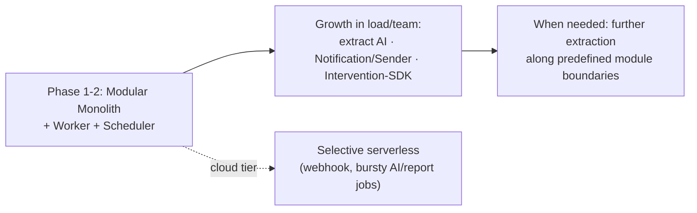
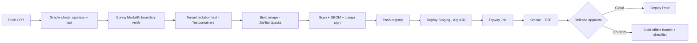

# DigiShield — Architecture Decision Records (ADR)

> A log of important architectural decisions. Each ADR records: Context → Decision → Consequences → Alternatives Considered → Review Conditions.

---

## ADR-001 — Deployment architecture style: Modular Monolith oriented toward gradual extraction

- **Status:** Accepted
- **Date:** 27/06/2026
- **Related:** `DigiShield_Technical_Design.md` (Ch.1, Ch.19 — incl. §19.11 Implementation Guide)

### Context

DigiShield is at the specification/MVP stage, with a small team, serving 3 segments with very different requirements:
- **Government Agencies:** mandatory **on-premise / air-gapped** deployment, data kept in-country.
- **Enterprises & Schools:** run on cloud (multi-tenant).

The workload has two distinct rhythms:
- *Synchronous, low-latency, high-availability:* web app/API, **transaction intervention SDK**, real-time WebSocket alerts.
- *Asynchronous, bursty:* bulk email/SMS sending, LLM calls, risk-score recalculation, scheduled campaigns.

We need to choose an architecture style that balances development speed, operating cost, and the ability to deploy to both cloud and on-prem.

### Decision

1. **The core is a Modular Monolith** — a single deployment unit, but divided into **internal modules with clear boundaries** matching the future services exactly: Auth, Learning, Simulation, Reporting, Analytics, Notification, AI, Tenancy/Billing. Modules communicate through internal interfaces; cross-module table access is forbidden.
2. **Separate asynchronous Workers from the start** — same codebase, different processes: API process + Worker pool + Scheduler, connected via a Message Queue. This is the minimum requirement regardless of architecture style.
3. **Package with containers (K8s/Helm)** so it can run on both cloud and on-prem/air-gapped.
4. **Do NOT use managed serverless (FaaS) as the core** — because it cannot be deployed in air-gapped environments and does not suit WebSocket/long-running jobs. Serverless is only used *selectively at the cloud tier* for bursty tasks, and there is always a standard worker alternative for the on-prem build.
5. **Split into microservices on demand (strangler pattern)** — only extract parts with their own rhythm/SLA/scale when genuinely needed (see roadmap).

### Evolution Roadmap



Priority order for extraction (when needed): **AI Service** (scales with LLM call volume), **Notification/Sender** (bursty email/SMS), **Intervention/SDK** (requires SLA & high availability, independent of the rest).

### Consequences

**Positive:**
- Fast development, one pipeline, one deployment; easy to debug and simple internal transactions.
- Runs on both cloud and on-prem/air-gapped → serves the government sector.
- Clear module boundaries make later microservice extraction less painful.

**Negative / to be controlled:**
- No independent per-part scaling yet → compensated by separating workers and scaling horizontally per process.
- Risk of a "tangled monolith" if module boundaries are loose → architectural discipline is mandatory: no cross-table calls, each module exposes an interface, dependency checks in CI (e.g., ArchUnit/eslint-boundaries).
- The "microservice" statement in the initial TDD needs to be revised to "modular monolith oriented toward gradual extraction."

### Alternatives Considered

| Alternative | Why not chosen |
|---|---|
| Full microservices immediately | Too early for a small team/MVP; operating cost (mesh, distributed transactions, observability) is not yet justified. Still the *destination* for the hot paths. |
| Pure serverless (FaaS) | Cannot run air-gapped (gov); poorly suited to WebSocket/long-running jobs; hard on-prem. Used only as a supplement on cloud. |
| **Modular monolith + worker (chosen)** | Balances speed, cost, and on-prem capability; preserves the evolution path to microservices. |

### Review Conditions for This ADR

Revisit when any of these signs appear: the development team exceeds ~3 groups needing independent deployment; a module (e.g., AI or Sender) becomes a scale/latency bottleneck; the monolith's build/test time becomes too long; or a separate SLA is required for the intervention SDK.

---

## ADR-002 — Backend stack: Java + Spring Boot + Spring Modulith

- **Status:** Accepted (runtime version revised — see "Runtime Java version" below)
- **Date:** 27/06/2026
- **Related:** ADR-001, the [Realization Appendix](#realization-appendix--directory-architecture-packaging--cicd) below

### Context

We need to finalize the backend language/framework. Key constraints & needs: **Vietnamese government/enterprise** customers (preference for the Java ecosystem, on-prem/air-gapped), a **modular monolith oriented toward gradual extraction** architecture (ADR-001), strong requirements for **SSO/SAML/OAuth/SCIM**, **bulk sending**, and **high concurrency** (WebSocket, intervention SDK).

### Decision

The backend uses **Java + Spring Boot + Spring Modulith** (realized on **Java 25 + Spring Boot 4.1.0 + Spring Modulith 2.1.0**; originally decided as Java 21 LTS + Spring Boot 3.5.x — see "Runtime Java version" below), with:
- **Spring Modulith** — realizes the modular monolith: module boundaries are automatically verified, communication via events, easy microservice extraction later (matches ADR-001).
- **Spring Security** — JWT, RBAC, SSO SAML/OAuth, SCIM.
- **Spring Batch** — campaigns & bulk email/SMS sending.
- **Hibernate multi-tenancy + PostgreSQL RLS** (`SET LOCAL app.tenant_id`); **Flyway** for multi-tenant migration.
- **Virtual threads (Project Loom)** enabled by default — high concurrency in synchronous style, no need for reactive.
- **Spring AI** — LLM integration. **Gradle** build; optional **GraalVM native image** for small on-prem builds.
- **Frontend** remains React/TypeScript (kept separate, using OpenAPI to generate the client).

### Consequences

**Positive:** easily accepted by the government sector & easy to hire for; Modulith matches the chosen architecture exactly; security/SSO/batch are available and mature; Loom handles concurrency neatly; runs anywhere with a JVM (cloud & on-prem).

**Negative / to be controlled:** the JVM uses more memory than Node → reduced with Loom + AppCDS + (optional) native image; FE/BE use different languages → compensated by generating the client from OpenAPI; JVM startup time → CDS/native for sensitive environments.

### Alternatives Considered

| Alternative | Why not chosen |
|---|---|
| Node.js + NestJS | Good for a pure JS/TS team wanting a shared language with the FE; but weaker on-prem acceptance in the government sector and on enterprise SSO/Batch maturity. |
| Go | Small footprint, fast; but a less rich enterprise SSO/Batch/ORM ecosystem, fewer engineers in Vietnam. |
| Quarkus/Micronaut | Lightweight & fast startup; smaller community/talent pool than Spring. |
| **Java 21 + Spring Boot + Modulith (chosen)** | The best balance for the Vietnamese gov/enterprise context + the ADR-001 architecture, on a fully-supported, stable toolchain. |

### Runtime Java version — Java 25 (current)

The build/runtime targets **Java 25 + Spring Boot 4.1.0 + Spring Modulith 2.1.0 + Gradle 9.6.1** (wrapper committed): toolchain `languageVersion = 25` in the convention plugins, runtime images `eclipse-temurin:25-jdk`/`:25-jre`, and CI `setup-java` 25. No Java 25-only language features are required (virtual threads, records, pattern matching all exist on earlier LTS too); the version is a toolchain/runtime choice.

> **History.** This ADR first targeted Java 25, then briefly pinned **Java 21 LTS** during early implementation for toolchain stability — Spring Boot 3.5.x + Gradle 8.x could not read class-file major version 69 (`Unsupported class file major version 69`). Once the ecosystem reached stable Java 25 support (Boot 4.x / Gradle 9.x), the forward-compatible upgrade path was taken (Gradle ≥ 9.1, Boot 4.x, `languageVersion` back to 25). Java 25 is the current state of the code.

### Review Conditions

Revisit if: the core team is not Java; an extremely low footprint / instant startup is needed at scale (consider native image or a lighter stack for some extracted services); a "single language for FE+BE" strategy becomes a priority; or a newer LTS becomes desirable.

---

## ADR-003 — Database migration tool: Flyway (not Liquibase)

- **Status:** Accepted
- **Date:** 27/06/2026
- **Related:** ADR-002, `DigiShield_Technical_Design.md` (§19.11 Implementation Guide), the [Realization Appendix](#realization-appendix--directory-architecture-packaging--cicd) below, skeleton `db/migration`

### Context

We need to choose a schema migration management tool. Specifics: **PostgreSQL only**, heavy use of Postgres-specific features (**Row-Level Security, `set_config`/GUC, `CREATE POLICY`**), a multi-tenant architecture (Pool/Bridge/Silo), and an agreed **forward-only expand→migrate→contract** strategy (ADR-001/guide).

### Decision

Use **Flyway** (SQL-first, `V<version>__name.sql`). Run migrations **via a dedicated Job** (Helm `pre-upgrade` hook), not letting the application self-migrate. Per tier:
- **Pool:** one shared schema, run once.
- **Bridge:** iterate over each tenant schema.
- **Silo/on-prem:** migration lives inside each tenant's deployment pipeline.

### Rationale

- Directly leverages **Postgres-specific SQL** (RLS/policy/GUC) — where Liquibase's abstraction layer adds no value (you still have to write raw `<sql>`) and is more verbose.
- Only one database type → Liquibase's "multi-database" strength is almost unneeded.
- The **forward-only expand→contract** strategy sharply reduces the need for rollback — which is Liquibase's biggest advantage.
- Simple, minimal configuration, easy to review diffs in PRs; fits the Spring Boot ecosystem.

### Consequences

**Positive:** simple, close to Postgres, integrates well with the migration Job & the specified CI/CD.

**Negative / to be controlled:** Flyway Community **has no undo/rollback** → compensated by forward-fix + backward-compatible migrations; **no contexts/labels** → tenant-tier differences are handled by pipeline orchestration (looping over schema/db) rather than declaratively.

### Alternatives Considered

| Alternative | Why not chosen |
|---|---|
| Liquibase | Strong on changeset rollback, contexts/labels (useful for tenant-tiers), and multi-database — but these strengths are little used with Postgres-only + many specific DDLs + forward-only. More verbose for RLS. |
| **Flyway (chosen)** | Simple, SQL-first, fits Postgres-specific features & the forward-only strategy. |

### Review Conditions

Switch to Liquibase if these arise: a hard requirement for **changeset rollback**; a need for declarative **contexts/labels** to manage migrations by tenant-tier/environment at large scale; or the need to support **multiple database types**. Migration cost is moderate since both can run SQL files.

## ADR-004 — Frontend: separate monorepo-lite app (React + TypeScript + Vite), OpenAPI-generated client

- **Status:** Accepted
- **Date:** 2026-06-27
- **Related:** ADR-002, `DigiShield_openapi.yaml`, `DigiShield_UIUX_Spec.md`

### Context

The backend is Java/Spring built with Gradle (ADR-002); the UI is a React/TypeScript SPA (UI/UX spec). We must decide where the frontend lives and how it integrates with the backend without coupling two incompatible build toolchains (Gradle/JVM vs Node/npm).

### Decision

1. **Monorepo-lite:** the frontend lives in a top-level `frontend/` directory next to `digishield/` (backend) and `docs/`, with its **own toolchain** (Vite + React + TypeScript + npm). It is **NOT** a Gradle subproject — the two build systems stay independent, each with its own CI job (path-filtered, at the repo-root `.github/workflows/`).
2. **OpenAPI is the integration contract.** A typed TypeScript client + TanStack Query hooks are **generated** from `DigiShield_openapi.yaml` (e.g. via `orval`), so the FE never hand-writes request/response types and cannot drift from the API.
3. **Feature-based structure + role-based routing.** Code is organized by feature (auth, learning, simulation, reporting, analytics, notification, tenancy, interception) with route guards enforcing RBAC for the 6 roles.
4. **Design system from the UI/UX spec** is implemented as CSS variables (tokens), matching the spec.
5. **Deployment flexibility (aligns with ADR-001):** the SPA builds to static assets. For cloud it is served via CDN; for on-premise/air-gapped it can be **bundled into `boot/app` static resources** to ship a single artifact. The build pipelines stay separate; bundling is an optional packaging step.

### Consequences

**Positive:** independent, idiomatic toolchains; atomic FE+BE changes in one repo (single team); contract safety via generated client; flexible deployment for cloud and on-prem.

**Negative / to control:** one repo hosts two ecosystems (clear directory + CI separation required); FE and BE may release at different cadences (handled by separate pipelines); the generated client must be regenerated when the OpenAPI changes (wire into CI).

### Alternatives considered

| Option | Why not chosen |
|---|---|
| Frontend as a Gradle subproject (e.g. node-gradle plugin) | Forces Node into the JVM build; brittle, slow, non-idiomatic. |
| Separate repository (polyrepo) | Better for independent teams/cadence, but adds cross-repo coordination for API changes; revisit if FE/BE become separate teams. |
| **Monorepo-lite with separate toolchain (chosen)** | Best balance for a single team: atomic changes + clean, idiomatic builds. |

### Revisit when

FE and BE are owned by separate teams with independent release cadence and governance — then split the frontend into its own repository, still consuming the published OpenAPI contract.

---

## Realization Appendix — Directory Architecture, Packaging & CI/CD

> Realizes **ADR-001** (Modular Monolith + separated Worker) and **ADR-002** (Java + Spring Boot + Spring Modulith).
> Stack (realized): **Java 25 · Spring Boot 4.1.0 · Spring Modulith 2.1.0 · Gradle 9.6.1** (wrapper committed), PostgreSQL, Redis, RabbitMQ/Kafka, Docker, Kubernetes + Helm, GitHub Actions (equivalents are interchangeable). CI/CD lives at the monorepo-root `.github/workflows/` (`backend-ci.yml` + `frontend-ci.yml`, path-filtered).

### A1. Organizing Principles

- **A single Spring Boot app** (modular monolith), divided into **Spring Modulith modules** with clear boundaries — Modulith **verifies boundaries automatically** in tests.
- **One artifact (JAR/image) → multiple run modes** (api/worker/scheduler) selected via **Spring profile**, not multiple separate applications.
- **Inter-module communication via events** (`ApplicationEventPublisher` + Spring Modulith Events, with an outbox for durability) instead of direct cross-calls → easier microservice extraction later.
- **Gradle multi-module** to isolate compilation & dependencies; business modules depend only on `shared` + `contracts`.

### A2. Directory Architecture (Gradle multi-module)

```
digishield/
├─ settings.gradle.kts          # declares the subprojects
├─ build.gradle.kts             # common configuration (Java 25, Spring BOM)
│
├─ boot/
│  └─ app/                      # the ONLY Spring Boot app (entrypoint)
│     ├─ src/main/java/com/digishield/DigishieldApplication.java
│     └─ src/main/resources/    # application.yml + profiles (api/worker/scheduler)
│
├─ modules/                     # business MODULES (Spring Modulith)
│  ├─ auth/
│  ├─ tenancy/                  # tenant, plan, subscription, feature-flags
│  ├─ learning/
│  ├─ simulation/
│  ├─ reporting/
│  ├─ analytics/
│  ├─ notification/
│  ├─ ai/
│  └─ interception/             # transaction intervention SDK
│
├─ shared/
│  ├─ persistence/              # JPA config, RLS, TenantRoutingDataSource
│  ├─ tenant-context/           # TenantContext (ThreadLocal), filter, AOP
│  ├─ messaging/                # queue abstraction (publish/consume) + outbox
│  ├─ security/                 # JWT, RBAC, SSO (SAML/OAuth), SCIM
│  └─ observability/            # Micrometer, tracing (attach tenant_id)
│
├─ contracts/                   # DTO, OpenAPI-generated types, event records
│
├─ db/migration/                # Flyway: V2026.06.27.001__*.sql (expand→migrate→contract)
│
├─ deploy/
│  ├─ docker/Dockerfile         # multi-stage, JRE 25, layered jar
│  ├─ helm/digishield/          # Helm chart (see section A7)
│  └─ compose/                  # docker-compose dev
│
├─ .github/workflows/           # CI/CD (see section A8)
└─ gradle/ + gradlew
```

**Why "1 boot app + multiple Gradle modules":** all business logic lives in `modules/*` (each a Gradle subproject, package-private internally). `boot/app` only assembles & configures. When extracting a microservice, create `boot/app-ai` depending only on `modules/ai` + `shared`.

**Boundary verification (Spring Modulith) — mandatory test:**

```java
class ModularityTests {
  @Test void verifyModules() {
    ApplicationModules.of(DigishieldApplication.class).verify(); // fail if a boundary is broken
  }
}
```

### A3. Structure of a Module (Spring Modulith)

Each module is a root package; internals are **package-private**, exposing the API only through interfaces/`@NamedInterface`:

```
modules/simulation/src/main/java/com/digishield/simulation/
├─ package-info.java          # @ApplicationModule(allowedDependencies = {"shared", "contracts"})
├─ api/                       # @NamedInterface: public service + event records
├─ domain/                    # entity, value object, pure rules
├─ application/               # use-case service, port
└─ infrastructure/            # JPA repository, adapter (queue, gateway)  ← package-private
```

- Other modules **cannot import** `infrastructure`/`domain` (Modulith blocks it) — they use only `api`.
- Inter-module communication via events:

```java
// simulation publishes an event, does NOT call learning directly
events.publishEvent(new UserClickedSimulation(tenantId, userId, campaignId));

// learning listens to auto-enroll
@ApplicationModuleListener
void on(UserClickedSimulation e) { enrollmentService.autoEnroll(e.userId()); }
```

### A4. Run mode: API · Worker · Scheduler (1 application)

Same JAR/image, role selected via **Spring profile**:

| Profile | What it enables | Scaled by |
|---|---|---|
| `api` | Web/WebSocket controllers; disables heavy listeners | QPS, WS connections |
| `worker` | Queue consumers (send email/SMS, AI jobs) | Queue depth |
| `scheduler` | `@Scheduled` (scheduled campaigns, risk computation) | 1 instance (ShedLock) |

```java
@Configuration @Profile("worker")
class WorkerConfig { /* declare listeners/consumers */ }

@Configuration @Profile("scheduler")
@EnableScheduling
class SchedulerConfig { /* use ShedLock so only 1 node runs cron */ }
```

Startup: `java -jar app.jar --spring.profiles.active=api` (or `worker`/`scheduler`). Enable virtual threads: `spring.threads.virtual.enabled=true`.

### A5. Tenant Context in Spring

#### A5.1. Hold the tenant per request

```java
public final class TenantContext {
  private static final ThreadLocal<String> CURRENT = new ThreadLocal<>();
  public static void set(String t){ CURRENT.set(t); }
  public static String require(){
    var t = CURRENT.get();
    if (t == null) throw new AccessDeniedException("Missing tenant context"); // fail-closed
    return t;
  }
  public static void clear(){ CURRENT.remove(); }
}
```

#### A5.2. Filter that extracts the tenant from the JWT

```java
@Component
class TenantFilter extends OncePerRequestFilter {
  protected void doFilterInternal(HttpServletRequest req, HttpServletResponse res, FilterChain chain)
      throws ... {
    try {
      var jwt = (Jwt) ((JwtAuthenticationToken) req.getUserPrincipal()).getToken();
      TenantContext.set(jwt.getClaimAsString("tid"));   // tenant_id from the token
      chain.doFilter(req, res);
    } finally { TenantContext.clear(); }     // must clear (even with virtual threads)
  }
}
```

#### A5.3. Apply the tenant to PostgreSQL (RLS) when opening a transaction

```java
@Aspect @Component
class TenantTransactionAspect {
  private final JdbcTemplate jdbc;
  @Before("@annotation(org.springframework.transaction.annotation.Transactional)")
  void setTenant() {
    jdbc.update("SET LOCAL app.tenant_id = ?", TenantContext.require()); // lives within the transaction
  }
}
```

> Worker/scheduler set `TenantContext` from the `tenant_id` in the message/job before processing. Every query must run inside `@Transactional` for `SET LOCAL` to take effect (matches RLS in Technical Design §19.11, the Implementation Guide).

### A6. Container Packaging

**One image**, multi-stage, JRE 25, layered jar (caches well):

```dockerfile
# deploy/docker/Dockerfile
FROM eclipse-temurin:25-jdk AS build
WORKDIR /src
COPY . .
RUN ./gradlew :boot:app:bootJar --no-daemon

FROM eclipse-temurin:25-jre AS runtime
WORKDIR /app
COPY --from=build /src/boot/app/build/libs/app.jar app.jar
ENV JAVA_TOOL_OPTIONS="-XX:+UseZGC -XX:MaxRAMPercentage=75"
ENV SPRING_THREADS_VIRTUAL_ENABLED=true
# profile selects the run mode, override in K8s
ENTRYPOINT ["java","-jar","app.jar"]
CMD ["--spring.profiles.active=api"]
```

**Dev local — docker-compose** (one image, 3 services with different profiles):

```yaml
services:
  api:       { build: ../.., command: ["--spring.profiles.active=api"], ports: ["8080:8080"] }
  worker:    { build: ../.., command: ["--spring.profiles.active=worker"] }
  scheduler: { build: ../.., command: ["--spring.profiles.active=scheduler"] }
  postgres:  { image: postgres:16 }
  redis:     { image: redis:7 }
  rabbitmq:  { image: rabbitmq:3-management }
```

> **Lightweight on-prem option:** build a **GraalVM native image** (`./gradlew nativeCompile`) for fast startup & low RAM.

### A7. Deployment with Helm (cloud & on-prem)

One chart, 3 Deployments (different `--spring.profiles.active`) + a Flyway migration Job.

```
deploy/helm/digishield/
├─ values.yaml            # cloud, pool
├─ values-onprem.yaml     # on-prem/air-gapped, silo
└─ templates/
   ├─ deployment-api.yaml
   ├─ deployment-worker.yaml
   ├─ deployment-scheduler.yaml
   ├─ job-flyway.yaml      # pre-upgrade hook: run migration before rollout
   ├─ hpa-api.yaml         # scale api
   ├─ hpa-worker.yaml      # scale worker by queue (KEDA)
   └─ service / ingress / configmap / secret
```

```yaml
# values.yaml (cloud, pool)
image: { repository: registry.digishield.vn/app, tag: "2.0.0" }
api:       { replicas: 3, args: ["--spring.profiles.active=api"] }
worker:    { replicas: 4, args: ["--spring.profiles.active=worker"] }
scheduler: { replicas: 1, args: ["--spring.profiles.active=scheduler"] }
flyway:    { enabled: true }          # runs as a Job, the app does NOT self-migrate
multitenancy: { defaultTier: pool, rls: true }
```

```yaml
# values-onprem.yaml (air-gapped, silo)
image: { repository: registry.internal.gov.vn/digishield/app, tag: "2.0.0" }
deployment: { airgapped: true }
multitenancy: { defaultTier: silo }
ingress: { host: digishield.internal.gov.vn, tls: internal-ca }
```

- **Migration:** disable `spring.flyway` auto in the app; run Flyway via a **Job (Helm pre-upgrade hook)** for control (expand→migrate→contract). The rollout only continues when the Job succeeds.
- **On-prem/air-gapped — offline bundle:** image `.tar` + chart `.tgz` + `values-onprem.yaml` + checklist; the customer runs `docker load` + `helm install`.

### A8. CI/CD pipeline

#### A8.1. Diagram



#### A8.2. Quality gates (block merge)

- `./gradlew check` (unit + integration), **Spring Modulith `verify()`** (boundaries), **tenant isolation test** (Testcontainers Postgres: tenant A cannot read B), spotless/format, minimum coverage.
- Vulnerability scan (Trivy/Grype) + SBOM + image signing (cosign).

#### A8.3. GitHub Actions (condensed)

```yaml
name: ci
on: [push, pull_request]
jobs:
  verify:
    runs-on: ubuntu-latest
    steps:
      - uses: actions/checkout@v4
      - uses: actions/setup-java@v4
        with: { distribution: temurin, java-version: '25' }
      - run: ./gradlew check   # includes Modulith verify + tenant isolation test
  build-push:
    needs: verify
    if: github.ref == 'refs/heads/main'
    runs-on: ubuntu-latest
    steps:
      - uses: actions/checkout@v4
      - uses: actions/setup-java@v4
        with: { distribution: temurin, java-version: '25' }
      - run: ./gradlew :boot:app:bootBuildImage --imageName=$REG/app:${{ github.sha }}  # Buildpacks
      - run: trivy image --exit-code 1 $REG/app:${{ github.sha }}
      - run: cosign sign --yes $REG/app:${{ github.sha }}
      - run: docker push $REG/app:${{ github.sha }}
  release-onprem:
    needs: build-push
    if: startsWith(github.ref, 'refs/tags/v')
    runs-on: ubuntu-latest
    steps:
      - run: docker save $REG/app:${{ github.ref_name }} -o app.tar
      - run: helm package deploy/helm/digishield
      - uses: actions/upload-artifact@v4
        with: { name: onprem-bundle, path: "app.tar\ndigishield-*.tgz" }
```

- **GitOps:** ArgoCD syncs Helm from Git (staging automatic, prod gated by approval).
- **On-prem is a versioned, signed artifact** for handover, not deployed directly.

### A9. Configuration, Secrets & Release Conventions

- **Config:** `application.yml` + overrides via environment variables (`SPRING_DATASOURCE_URL`, `SPRING_RABBITMQ_ADDRESSES`, `JWT_JWK_SET_URI`, `MT_DEFAULT_TIER`, `LLM_API_BASE`…); profiles `api|worker|scheduler` + `cloud|onprem`.
- **Secrets:** cloud uses Vault/cloud KMS + Spring Cloud Vault/External Secrets; on-prem uses internal secrets. Do not commit secrets.
- **Health:** Spring Boot Actuator `/actuator/health/{liveness,readiness}` for every run mode; worker readiness when it can connect to the queue.
- **Observability:** Micrometer → Prometheus; OpenTelemetry tracing; JSON logs tagged with `tenant_id` (no PII logging).
- **Branching & release:** trunk-based, short PRs; **SemVer + tag `vX.Y.Z`** triggers the cloud release & on-prem bundle build.
- **Zero-downtime:** rolling update + backward-compatible migration (expand→migrate→contract); rollback via `helm rollback`.
- **Government on-prem:** a separate release cycle, deliver bundle + upgrade notes, no forced lockstep with cloud.

> The code/charts in this appendix are samples — adjust to your actual choices (e.g., Maven instead of Gradle, Kafka instead of RabbitMQ, Buildpacks/Jib optional, GraalVM native for lightweight on-prem).

---

*Add new ADRs above this appendix following the same template (ADR-005…).*
