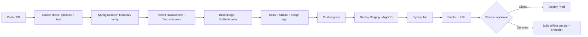

# DigiShield — Directory Architecture, Packaging & CI/CD (Java/Spring)

> Version 2.0 · 27/06/2026
> Realizes **ADR-001** (Modular Monolith + separated Worker) and **ADR-002** (Java 21 + Spring Boot + Spring Modulith).
> Stack: **Java 21 (LTS) · Spring Boot 3.5.x · Spring Modulith · Gradle**, PostgreSQL, Redis, RabbitMQ/Kafka, Docker, Kubernetes + Helm, GitHub Actions (equivalents are interchangeable).

---

## Table of Contents
1. [Organizing Principles](#1-organizing-principles)
2. [Directory Architecture (Gradle multi-module)](#2-directory-architecture-gradle-multi-module)
3. [Structure of a Module (Spring Modulith)](#3-structure-of-a-module-spring-modulith)
4. [Run mode: API · Worker · Scheduler (1 application)](#4-run-mode-api--worker--scheduler-1-application)
5. [Tenant Context in Spring](#5-tenant-context-in-spring)
6. [Container Packaging](#6-container-packaging)
7. [Deployment with Helm (cloud & on-prem)](#7-deployment-with-helm-cloud--on-prem)
8. [CI/CD pipeline](#8-cicd-pipeline)
9. [Configuration, Secrets & Release Conventions](#9-configuration-secrets--release-conventions)

---

## 1. Organizing Principles

- **A single Spring Boot app** (modular monolith), divided into **Spring Modulith modules** with clear boundaries — Modulith **verifies boundaries automatically** in tests.
- **One artifact (JAR/image) → multiple run modes** (api/worker/scheduler) selected via **Spring profile**, not multiple separate applications.
- **Inter-module communication via events** (`ApplicationEventPublisher` + Spring Modulith Events, with an outbox for durability) instead of direct cross-calls → easier microservice extraction later.
- **Gradle multi-module** to isolate compilation & dependencies; business modules depend only on `shared` + `contracts`.

---

## 2. Directory Architecture (Gradle multi-module)

```
digishield/
├─ settings.gradle.kts          # declares the subprojects
├─ build.gradle.kts             # common configuration (Java 21, Spring BOM)
│
├─ boot/
│  └─ app/                      # the ONLY Spring Boot app (entrypoint)
│     ├─ src/main/java/com/digishield/DigishieldApplication.java
│     └─ src/main/resources/    # application.yml + profiles (api/worker/scheduler)
│
├─ modules/                     # business MODULES (Spring Modulith)
│  ├─ auth/
│  ├─ tenancy/                  # tenant, plan, subscription, feature-flags
│  ├─ learning/
│  ├─ simulation/
│  ├─ reporting/
│  ├─ analytics/
│  ├─ notification/
│  ├─ ai/
│  └─ interception/             # transaction intervention SDK
│
├─ shared/
│  ├─ persistence/              # JPA config, RLS, TenantRoutingDataSource
│  ├─ tenant-context/           # TenantContext (ThreadLocal), filter, AOP
│  ├─ messaging/                # queue abstraction (publish/consume) + outbox
│  ├─ security/                 # JWT, RBAC, SSO (SAML/OAuth), SCIM
│  └─ observability/            # Micrometer, tracing (attach tenant_id)
│
├─ contracts/                   # DTO, OpenAPI-generated types, event records
│
├─ db/migration/                # Flyway: V2026.06.27.001__*.sql (expand→migrate→contract)
│
├─ deploy/
│  ├─ docker/Dockerfile         # multi-stage, JRE 25, layered jar
│  ├─ helm/digishield/          # Helm chart (see section 7)
│  └─ compose/                  # docker-compose dev
│
├─ .github/workflows/           # CI/CD (see section 8)
└─ gradle/ + gradlew
```

**Why "1 boot app + multiple Gradle modules":** all business logic lives in `modules/*` (each a Gradle subproject, package-private internally). `boot/app` only assembles & configures. When extracting a microservice, create `boot/app-ai` depending only on `modules/ai` + `shared`.

**Boundary verification (Spring Modulith) — mandatory test:**

```java
class ModularityTests {
  @Test void verifyModules() {
    ApplicationModules.of(DigishieldApplication.class).verify(); // fail if a boundary is broken
  }
}
```

---

## 3. Structure of a Module (Spring Modulith)

Each module is a root package; internals are **package-private**, exposing the API only through interfaces/`@NamedInterface`:

```
modules/simulation/src/main/java/com/digishield/simulation/
├─ package-info.java          # @ApplicationModule(allowedDependencies = {"shared", "contracts"})
├─ api/                       # @NamedInterface: public service + event records
├─ domain/                    # entity, value object, pure rules
├─ application/               # use-case service, port
└─ infrastructure/            # JPA repository, adapter (queue, gateway)  ← package-private
```

- Other modules **cannot import** `infrastructure`/`domain` (Modulith blocks it) — they use only `api`.
- Inter-module communication via events:

```java
// simulation publishes an event, does NOT call learning directly
events.publishEvent(new UserClickedSimulation(tenantId, userId, campaignId));

// learning listens to auto-enroll
@ApplicationModuleListener
void on(UserClickedSimulation e) { enrollmentService.autoEnroll(e.userId()); }
```

---

## 4. Run mode: API · Worker · Scheduler (1 application)

Same JAR/image, role selected via **Spring profile**:

| Profile | What it enables | Scaled by |
|---|---|---|
| `api` | Web/WebSocket controllers; disables heavy listeners | QPS, WS connections |
| `worker` | Queue consumers (send email/SMS, AI jobs) | Queue depth |
| `scheduler` | `@Scheduled` (scheduled campaigns, risk computation) | 1 instance (ShedLock) |

```java
@Configuration @Profile("worker")
class WorkerConfig { /* declare listeners/consumers */ }

@Configuration @Profile("scheduler")
@EnableScheduling
class SchedulerConfig { /* use ShedLock so only 1 node runs cron */ }
```

Startup: `java -jar app.jar --spring.profiles.active=api` (or `worker`/`scheduler`). Enable virtual threads: `spring.threads.virtual.enabled=true`.

---

## 5. Tenant Context in Spring

### 5.1. Hold the tenant per request

```java
public final class TenantContext {
  private static final ThreadLocal<String> CURRENT = new ThreadLocal<>();
  public static void set(String t){ CURRENT.set(t); }
  public static String require(){
    var t = CURRENT.get();
    if (t == null) throw new AccessDeniedException("Missing tenant context"); // fail-closed
    return t;
  }
  public static void clear(){ CURRENT.remove(); }
}
```

### 5.2. Filter that extracts the tenant from the JWT

```java
@Component
class TenantFilter extends OncePerRequestFilter {
  protected void doFilterInternal(HttpServletRequest req, HttpServletResponse res, FilterChain chain)
      throws ... {
    try {
      var jwt = (Jwt) ((JwtAuthenticationToken) req.getUserPrincipal()).getToken();
      TenantContext.set(jwt.getClaimAsString("tid"));   // tenant_id from the token
      chain.doFilter(req, res);
    } finally { TenantContext.clear(); }     // must clear (even with virtual threads)
  }
}
```

### 5.3. Apply the tenant to PostgreSQL (RLS) when opening a transaction

```java
@Aspect @Component
class TenantTransactionAspect {
  private final JdbcTemplate jdbc;
  @Before("@annotation(org.springframework.transaction.annotation.Transactional)")
  void setTenant() {
    jdbc.update("SET LOCAL app.tenant_id = ?", TenantContext.require()); // lives within the transaction
  }
}
```

> Worker/scheduler set `TenantContext` from the `tenant_id` in the message/job before processing. Every query must run inside `@Transactional` for `SET LOCAL` to take effect (matches RLS in the Multi-tenant Implementation Guide).

---

## 6. Container Packaging

**One image**, multi-stage, JRE 25, layered jar (caches well):

```dockerfile
# deploy/docker/Dockerfile
FROM eclipse-temurin:21-jdk AS build
WORKDIR /src
COPY . .
RUN ./gradlew :boot:app:bootJar --no-daemon

FROM eclipse-temurin:21-jre AS runtime
WORKDIR /app
COPY --from=build /src/boot/app/build/libs/app.jar app.jar
ENV JAVA_TOOL_OPTIONS="-XX:+UseZGC -XX:MaxRAMPercentage=75"
ENV SPRING_THREADS_VIRTUAL_ENABLED=true
# profile selects the run mode, override in K8s
ENTRYPOINT ["java","-jar","app.jar"]
CMD ["--spring.profiles.active=api"]
```

**Dev local — docker-compose** (one image, 3 services with different profiles):

```yaml
services:
  api:       { build: ../.., command: ["--spring.profiles.active=api"], ports: ["8080:8080"] }
  worker:    { build: ../.., command: ["--spring.profiles.active=worker"] }
  scheduler: { build: ../.., command: ["--spring.profiles.active=scheduler"] }
  postgres:  { image: postgres:16 }
  redis:     { image: redis:7 }
  rabbitmq:  { image: rabbitmq:3-management }
```

> **Lightweight on-prem option:** build a **GraalVM native image** (`./gradlew nativeCompile`) for fast startup & low RAM.

---

## 7. Deployment with Helm (cloud & on-prem)

One chart, 3 Deployments (different `--spring.profiles.active`) + a Flyway migration Job.

```
deploy/helm/digishield/
├─ values.yaml            # cloud, pool
├─ values-onprem.yaml     # on-prem/air-gapped, silo
└─ templates/
   ├─ deployment-api.yaml
   ├─ deployment-worker.yaml
   ├─ deployment-scheduler.yaml
   ├─ job-flyway.yaml      # pre-upgrade hook: run migration before rollout
   ├─ hpa-api.yaml         # scale api
   ├─ hpa-worker.yaml      # scale worker by queue (KEDA)
   └─ service / ingress / configmap / secret
```

```yaml
# values.yaml (cloud, pool)
image: { repository: registry.digishield.vn/app, tag: "2.0.0" }
api:       { replicas: 3, args: ["--spring.profiles.active=api"] }
worker:    { replicas: 4, args: ["--spring.profiles.active=worker"] }
scheduler: { replicas: 1, args: ["--spring.profiles.active=scheduler"] }
flyway:    { enabled: true }          # runs as a Job, the app does NOT self-migrate
multitenancy: { defaultTier: pool, rls: true }
```

```yaml
# values-onprem.yaml (air-gapped, silo)
image: { repository: registry.internal.gov.vn/digishield/app, tag: "2.0.0" }
deployment: { airgapped: true }
multitenancy: { defaultTier: silo }
ingress: { host: digishield.internal.gov.vn, tls: internal-ca }
```

- **Migration:** disable `spring.flyway` auto in the app; run Flyway via a **Job (Helm pre-upgrade hook)** for control (expand→migrate→contract). The rollout only continues when the Job succeeds.
- **On-prem/air-gapped — offline bundle:** image `.tar` + chart `.tgz` + `values-onprem.yaml` + checklist; the customer runs `docker load` + `helm install`.

---

## 8. CI/CD pipeline

### 8.1. Diagram



### 8.2. Quality gates (block merge)

- `./gradlew check` (unit + integration), **Spring Modulith `verify()`** (boundaries), **tenant isolation test** (Testcontainers Postgres: tenant A cannot read B), spotless/format, minimum coverage.
- Vulnerability scan (Trivy/Grype) + SBOM + image signing (cosign).

### 8.3. GitHub Actions (condensed)

```yaml
name: ci
on: [push, pull_request]
jobs:
  verify:
    runs-on: ubuntu-latest
    steps:
      - uses: actions/checkout@v4
      - uses: actions/setup-java@v4
        with: { distribution: temurin, java-version: '25' }
      - run: ./gradlew check   # includes Modulith verify + tenant isolation test
  build-push:
    needs: verify
    if: github.ref == 'refs/heads/main'
    runs-on: ubuntu-latest
    steps:
      - uses: actions/checkout@v4
      - uses: actions/setup-java@v4
        with: { distribution: temurin, java-version: '25' }
      - run: ./gradlew :boot:app:bootBuildImage --imageName=$REG/app:${{ github.sha }}  # Buildpacks
      - run: trivy image --exit-code 1 $REG/app:${{ github.sha }}
      - run: cosign sign --yes $REG/app:${{ github.sha }}
      - run: docker push $REG/app:${{ github.sha }}
  release-onprem:
    needs: build-push
    if: startsWith(github.ref, 'refs/tags/v')
    runs-on: ubuntu-latest
    steps:
      - run: docker save $REG/app:${{ github.ref_name }} -o app.tar
      - run: helm package deploy/helm/digishield
      - uses: actions/upload-artifact@v4
        with: { name: onprem-bundle, path: "app.tar\ndigishield-*.tgz" }
```

- **GitOps:** ArgoCD syncs Helm from Git (staging automatic, prod gated by approval).
- **On-prem is a versioned, signed artifact** for handover, not deployed directly.

---

## 9. Configuration, Secrets & Release Conventions

- **Config:** `application.yml` + overrides via environment variables (`SPRING_DATASOURCE_URL`, `SPRING_RABBITMQ_ADDRESSES`, `JWT_JWK_SET_URI`, `MT_DEFAULT_TIER`, `LLM_API_BASE`…); profiles `api|worker|scheduler` + `cloud|onprem`.
- **Secrets:** cloud uses Vault/cloud KMS + Spring Cloud Vault/External Secrets; on-prem uses internal secrets. Do not commit secrets.
- **Health:** Spring Boot Actuator `/actuator/health/{liveness,readiness}` for every run mode; worker readiness when it can connect to the queue.
- **Observability:** Micrometer → Prometheus; OpenTelemetry tracing; JSON logs tagged with `tenant_id` (no PII logging).
- **Branching & release:** trunk-based, short PRs; **SemVer + tag `vX.Y.Z`** triggers the cloud release & on-prem bundle build.
- **Zero-downtime:** rolling update + backward-compatible migration (expand→migrate→contract); rollback via `helm rollback`.
- **Government on-prem:** a separate release cycle, deliver bundle + upgrade notes, no forced lockstep with cloud.

---

*This document realizes ADR-001 & ADR-002. The code/charts are samples — adjust to your actual choices (e.g., Maven instead of Gradle, Kafka instead of RabbitMQ, Buildpacks/Jib optional, GraalVM native for lightweight on-prem).*
