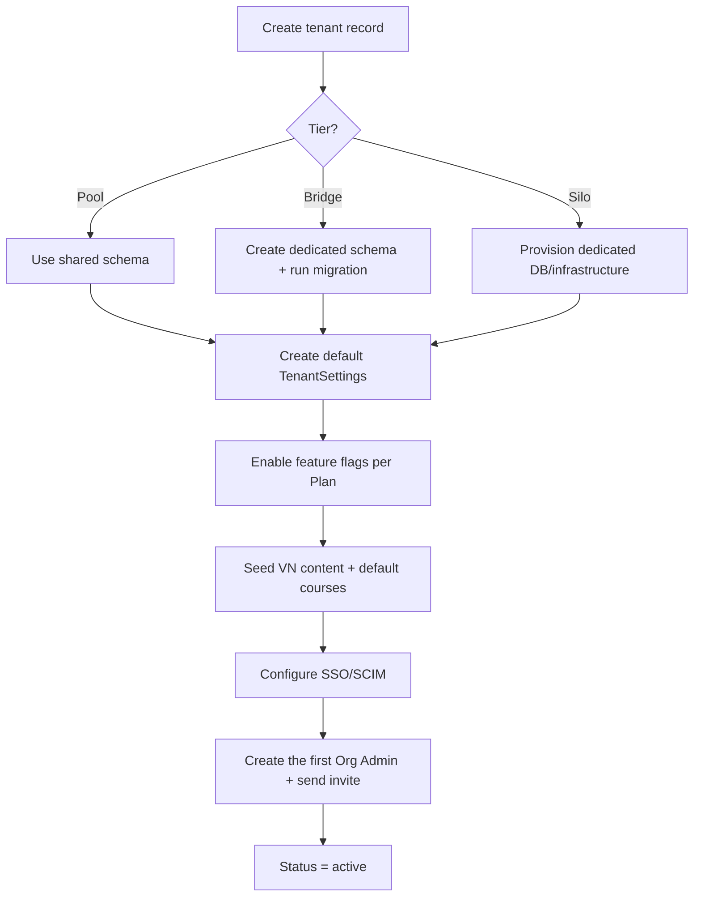

# DigiShield — Multi-tenant Implementation Guide

> Version 1.0 · 27/06/2026
> Implementation/deployment document accompanying **Chapter 19** of `DigiShield_Technical_Design.md`.
> Level: engineering (code) + infrastructure (DevOps) + operations runbook. Stack per **ADR-002: Java 21 + Spring Boot** (see the Java tenant-context code sample in `DigiShield_Architecture_Deploy_CICD.md` §5). The snippets below are pseudo-code illustrating the concepts, applied equivalently in Spring.

---

## Table of Contents
1. [Principles & Model Selection](#1-principles--model-selection)
2. [Data Layer — PostgreSQL Row-Level Security](#2-data-layer--postgresql-row-level-security)
3. [Tenant Context at the Application Layer](#3-tenant-context-at-the-application-layer)
4. [Propagating the Tenant to Cache, Queue, Storage](#4-propagating-the-tenant-to-cache-queue-storage)
5. [Tenant Provisioning](#5-tenant-provisioning)
6. [Feature Flags & Per-tenant Configuration](#6-feature-flags--per-tenant-configuration)
7. [Infrastructure Deployment per Tier](#7-infrastructure-deployment-per-tier)
8. [CI/CD & Multi-tenant Migration](#8-cicd--multi-tenant-migration)
9. [Data Residency & BYOK](#9-data-residency--byok)
10. [Per-tenant Metering, Quota & Observability](#10-per-tenant-metering-quota--observability)
11. [Tenant Isolation Testing](#11-tenant-isolation-testing)
12. [Operations Runbook](#12-operations-runbook)
13. [Security & Compliance Checklist](#13-security--compliance-checklist)

---

## 1. Principles & Model Selection

| Principle | Meaning |
|---|---|
| Isolate at the DB layer, not just the app layer | Enable RLS so the DB itself blocks cross-tenant leakage, even when the code has a bug |
| `tenant_id` is a first-class citizen | Every business table, every cache/queue/storage key, every log/metric |
| One codebase, multiple tiers | Pool (default) → Bridge → Silo/on-prem; chosen by segment & compliance |
| Fail-closed | Missing tenant context ⇒ reject the request, return no data |

**Tier selection by segment:** Schools → Pool; Enterprises → Bridge; Government Agencies → Silo/On-prem (see TDD Chapter 19).

---

## 2. Data Layer — PostgreSQL Row-Level Security

### 2.1. tenant_id column + index

Every business table:

```sql
ALTER TABLE reports ADD COLUMN tenant_id uuid NOT NULL;
CREATE INDEX idx_reports_tenant ON reports (tenant_id);
```

### 2.2. Enable RLS + policy

```sql
ALTER TABLE reports ENABLE ROW LEVEL SECURITY;
ALTER TABLE reports FORCE ROW LEVEL SECURITY;   -- also applies to the table owner

CREATE POLICY tenant_isolation ON reports
  USING       (tenant_id = current_setting('app.tenant_id', true)::uuid)
  WITH CHECK  (tenant_id = current_setting('app.tenant_id', true)::uuid);
```

- `USING` blocks READS; `WITH CHECK` blocks WRITES of wrong-tenant data.
- `current_setting('app.tenant_id', true)`: the `true` parameter avoids an error when not set — but combined with fail-closed at the app (section 3).

### 2.3. Non-superuser DB role

RLS is **bypassed** for superuser/owner unless FORCE is used. The application must connect using a regular role:

```sql
CREATE ROLE app_user LOGIN PASSWORD '***';
GRANT SELECT, INSERT, UPDATE, DELETE ON ALL TABLES IN SCHEMA public TO app_user;
```

### 2.4. Set the tenant per transaction (note connection pooling)

Because the pool reuses connections, do **not** use `SET` (session); use `SET LOCAL` within a **transaction**:

```sql
BEGIN;
SET LOCAL app.tenant_id = '6f1c...';   -- only lives within this transaction
-- ... queries ...
COMMIT;
```

> **PgBouncer:** use *transaction pooling* + `SET LOCAL` (safe). Avoid session-level `SET` because the connection is reused for another tenant.

### 2.5. Migration per tier

| Tier | How to run migration |
|---|---|
| Pool | 1 shared schema → run once |
| Bridge | Iterate over each tenant schema (`SET search_path`) → run sequentially, record the version per schema |
| Silo | Each DB/tenant runs independently within that tenant's deployment pipeline |

---

## 3. Tenant Context at the Application Layer

### 3.1. The JWT carries tenant_id

The access token contains the claim `tid` (tenant_id) + `org`, `role`. Authentication happens at the Gateway; the service trusts the already-verified token.

### 3.2. Middleware that extracts & stores the context (illustration — the Java/Spring version is in the Architecture doc §5)

```ts
// tenant-context.ts
import { AsyncLocalStorage } from 'async_hooks';
export const tenantStore = new AsyncLocalStorage<{ tenantId: string }>();
export const currentTenant = () => {
  const ctx = tenantStore.getStore();
  if (!ctx?.tenantId) throw new ForbiddenException('Missing tenant context'); // fail-closed
  return ctx.tenantId;
};

// tenant.middleware.ts
@Injectable()
export class TenantMiddleware implements NestMiddleware {
  use(req: Request, _res: Response, next: () => void) {
    const tenantId = req.user?.tid;            // already decoded from the JWT
    if (!tenantId) throw new ForbiddenException('No tenant');
    tenantStore.run({ tenantId }, () => next());
  }
}
```

### 3.3. Apply the tenant to every DB query

Wrap each request/transaction to set `app.tenant_id`:

```ts
async function withTenant<T>(db: DataSource, fn: (m: EntityManager) => Promise<T>) {
  return db.transaction(async (m) => {
    await m.query(`SET LOCAL app.tenant_id = $1`, [currentTenant()]);
    return fn(m);
  });
}
```

> Principle: do **not** allow DB queries outside `withTenant` (lint/review blocks them). This is the last line of defense alongside RLS.

---

## 4. Propagating the Tenant to Cache, Queue, Storage

| Infrastructure | Convention |
|---|---|
| Redis | Key prefix: `t:{tenantId}:user:{id}` ; scan/delete by prefix on offboard |
| Message queue | Add `tenant_id` to the header/payload; the worker runs `SET LOCAL` before processing; consider a dedicated queue/topic per large tenant |
| Object storage | Prefix/bucket: `s3://digishield/{tenantId}/reports/...` ; IAM policy by prefix |
| Log / Metrics / Trace | Tag with `tenant_id` (but do NOT log sensitive personal data) |

Sample worker:

```ts
queue.process(async (job) => {
  await tenantStore.run({ tenantId: job.data.tenant_id }, async () => {
    await withTenant(db, (m) => handle(job, m));
  });
});
```

---

## 5. Tenant Provisioning

### 5.1. Flow



### 5.2. Provisioning script (condensed)

```ts
async function provisionTenant(input) {
  const tenant = await createTenant({ name: input.name, tier: input.tier, region: 'vn', status: 'provisioning' });
  if (input.tier === 'bridge') await createSchemaAndMigrate(tenant.id);
  if (input.tier === 'silo')   await provisionDedicatedDb(tenant.id);   // IaC: Terraform/Helm
  await seedDefaultSettings(tenant.id);
  await applyPlanFeatureFlags(tenant.id, input.planId);
  await seedDefaultContent(tenant.id);            // VN fraud scenarios, basic courses
  await configureSso(tenant.id, input.sso);
  await inviteOrgAdmin(tenant.id, input.adminEmail);
  await setTenantStatus(tenant.id, 'active');
  return tenant;
}
```

Corresponding API: `POST /tenants`, `PATCH /tenants/{id}`, `PATCH /tenants/{id}/feature-flags` (see OpenAPI).

---

## 6. Feature Flags & Per-tenant Configuration

- Load `feature_flags` + `tenant_settings` when initializing a session; cache by `t:{tenantId}:flags` (short TTL + invalidation on change).
- Check flags on both the backend (block the API) and the frontend (hide the UI).

```ts
if (!await flags.enabled('deepfake_sim')) throw new ForbiddenException('Feature off for tenant');
```

- `tenant_settings`: branding (logo/color/subdomain), policy (risk threshold, mandatory training), `default_locale`.

---

## 7. Infrastructure Deployment per Tier

### 7.1. Pooled cloud (default — schools, SMB)

- One K8s cluster, one shared set of services, one DB (Pool + RLS).
- **Logical** tenant separation; scale out (HPA) as load grows.

```yaml
# helm values (condensed)
deployment:
  replicas: 3
database:
  mode: pool          # shared db + RLS
  url: postgres://app_user@pg-primary/digishield
multitenancy:
  defaultTier: pool
  rls: true
```

### 7.2. Bridge / Dedicated (enterprise)

- Shared cluster but a **dedicated schema** per tenant; or a dedicated namespace/DB for large customers.
- Deployed with the same Helm chart, different `values` (mode: bridge, schema per tenant).

### 7.3. Silo / On-premise / Air-gapped (government)

- Install the full suite within internal infrastructure; data kept in-country.
- Package images offline (internal registry), Helm chart + dedicated DB; disable all unnecessary outbound calls, use an internal blacklist source synced periodically.

```yaml
multitenancy:
  defaultTier: silo
deployment:
  airgapped: true
  imageRegistry: registry.internal.gov.vn/digishield
```

### 7.4. Tenant routing

- Subdomain `tenantA.digishield.vn` or header → the Gateway maps to `tenant_id`.
- For Silo: a dedicated DNS/endpoint per agency.

---

## 8. CI/CD & Multi-tenant Migration

- Pipeline: build → test (including tenant isolation test, section 11) → deploy staging → migration → smoke test → deploy prod.
- **Safe migration (zero-downtime):** expand → migrate → contract (add nullable columns first, backfill, then add constraints/drop the old).
- Bridge: the migration job iterates over all schemas; records the version per tenant; can run in batches (canary a few tenants first).
- Silo: migration lives in each tenant's deployment pipeline; controlled rollout.

```bash
# example: run migration for every schema (bridge)
for schema in $(psql -tAc "select schema_name from tenants_schema"); do
  psql -c "SET search_path=$schema" -f migrations/2026_06_27_add_table.sql
done
```

---

## 9. Data Residency & BYOK

- **Residency:** by default stored in-country; with Silo/on-prem, data never leaves the organization's infrastructure.
- **BYOK (envelope encryption):** each tenant has one Data Encryption Key (DEK) wrapped by a Key Encryption Key (KEK) in the tenant's KMS/HSM. Sensitive data (report payloads, PII) is encrypted with the DEK.
- Rotate keys periodically; revoking the KEK ⇒ invalidates the tenant's data (useful at offboard).

---

## 10. Per-tenant Metering, Quota & Observability

- **Metering:** emit usage events (`email_sent`, `sms_sent`, `ai_call`, `storage`) → aggregate into `usage_metering` per period → the source for invoices & over-limit alerts (`GET /tenants/{id}/usage`).
- **Quota & rate-limit:** configured per Plan; block/advise when limits are reached; partition queues to avoid the "noisy neighbor" problem.
- **Observability:** every log/metric/trace is tagged with a `tenant_id` label; dashboards filter by tenant; per-tenant alerts (e.g., a sudden spike in error rate for one tenant).

---

## 11. Tenant Isolation Testing

Mandatory in CI — this is the "safety net" for RLS:

```ts
it('tenant A cannot read tenant B data', async () => {
  const a = await seedTenantWithReport('A');
  const b = await seedTenantWithReport('B');

  const asA = await withTenantCtx(a.id, () => repo.find());     // set app.tenant_id = A
  expect(asA.map(r => r.tenant_id)).toEqual([a.id]);            // sees only A
  expect(asA.find(r => r.tenant_id === b.id)).toBeUndefined();  // does NOT see B
});

it('rejected when there is no tenant context', async () => {
  await expect(repo.find()).rejects.toThrow('Missing tenant context'); // fail-closed
});
```

Additional: test that writing to the wrong tenant is blocked by `WITH CHECK`; test that cache/queue prefixes do not mix.

---

## 12. Operations Runbook

### 12.1. Provision a tenant
1. `POST /tenants` (name, tier, plan) → create a `provisioning` record.
2. (Bridge/Silo) create the schema/DB + migrate.
3. Seed settings, feature flags, content; configure SSO/SCIM.
4. Invite the Org Admin; switch to `status=active`.

### 12.2. Suspend / Resume
- Suspend (overdue/violation): `PATCH /tenants/{id}` `status=suspended` → block login, keep the data intact.
- Resume: `status=active`.

### 12.3. Offboard (contract termination)
1. Set `status=offboarding` (read-only).
2. **Export data** to the customer (standard format, with integrity checks).
3. After the retention period → **permanently delete** (purge) per the Personal Data Protection Decree: delete DB records, object storage (tenant prefix), cache (prefix), and backups per the retention policy; revoke the KEK (BYOK).
4. Record all offboard operations in `audit_logs`.

### 12.4. Offboard checklist
- [ ] Notify & confirm with the customer.
- [ ] Export + hand over the data.
- [ ] Delete the DB/schema (per tier), storage prefix, cache prefix.
- [ ] Revoke/destroy the encryption keys.
- [ ] Remove the SSO/SCIM configuration, DNS/subdomain.
- [ ] Save proof of completion (audit).

---

## 13. Security & Compliance Checklist

- [ ] RLS enabled + FORCE on every business table; the app uses a non-superuser role.
- [ ] Every query goes through `withTenant`; lint blocks context-less queries.
- [ ] Fail-closed when the tenant context is missing.
- [ ] Cache/queue/storage all carry the tenant prefix.
- [ ] Tenant isolation tests run in CI and are a merge-blocking condition.
- [ ] Personal data encrypted at-rest; BYOK for enterprise/gov.
- [ ] Data residency in-country; on-prem for the government sector.
- [ ] Audit logs separated per tenant; offboard includes export + compliant purge.
- [ ] Quota/rate-limit per Plan; accurate metering for billing.

---

*Implementation document — the code/charts are illustrative samples, adjust to your actual stack. Accompanies Chapter 19 (design) in `DigiShield_Technical_Design.md` and the Tenancy/Billing endpoints in `DigiShield_openapi.yaml`.*
