# DIGITAL SHIELD (DigiShield) — Technical Design Document (TDD)

> Version 1.0 · 06/27/2026
> Document with diagrams (Mermaid) + API specification. To be used alongside **DigiShield_Product_Technical_Spec_v2.docx** (product specification) and **DigiShield_openapi.yaml** (machine-readable API specification).
>
> The ```mermaid``` blocks render directly on GitHub, GitLab, VS Code (Mermaid extension), Obsidian, etc. If you need images, use [mermaid.live](https://mermaid.live) and paste the code to export PNG/SVG.

---

## Table of Contents
1. [Architecture Overview](#1-architecture-overview)
2. [System Context Diagram (C4 – Context)](#2-system-context-diagram-c4--context)
3. [Component Diagram (Container/Component)](#3-component-diagram-containercomponent)
4. [Deployment Diagram](#4-deployment-diagram)
5. [Data Model (ER Diagram)](#5-data-model-er-diagram)
6. [Sequence Diagrams (Business Flows)](#6-sequence-diagrams-business-flows)
7. [State Diagrams (Entity Lifecycles)](#7-state-diagrams-entity-lifecycles)
8. [Flowchart – Risk Score Calculation](#8-flowchart--risk-score-calculation)
9. [REST API Specification](#9-rest-api-specification)
10. [Event Model (Event/Queue)](#10-event-model-eventqueue)
11. [Security & Non-functional Requirements](#11-security--non-functional-requirements)
12. [100% Specification Closure Supplement](#12-100-specification-closure-supplement)
13. [WebSocket Specification (Realtime)](#13-websocket-specification-realtime)
14. [Traceability Matrix](#14-traceability-matrix)
15. [v1.2 Supplement — Proactive Detection & OTT Channels](#15-v12-supplement--proactive-detection--ott-channels)
16. [Use Case Diagram (UML)](#16-use-case-diagram-uml)
17. [BPMN Process Diagrams](#17-bpmn-process-diagrams)
18. [Data Flow Diagram (DFD)](#18-data-flow-diagram-dfd)
19. [Multi-tenant SaaS Architecture](#19-multi-tenant-saas-architecture)

---

## 1. Architecture Overview

DigiShield is a **multi-tenant SaaS** platform built on a **gradually-decoupling, event-driven modular monolith** architecture — the core is a single deployment unit with clearly bounded modules (Auth, Learning, Simulation, Reporting, Analytics, Notification, AI, Tenancy/Billing), progressively split into microservices as scaling/team needs arise (see **ADR-001** in `DigiShield_ADR.md`). Each organization (tenant) has its data logically isolated via `org_id`/`tenant_id`. Heavy tasks (bulk email/SMS sending, AI analysis) run asynchronously through queues using a separate worker pool. Packaged in containers so it can run both in the cloud and on-premise/air-gapped (government sector); managed serverless is not used as the core.

**Key design principles:**
- API-first: every capability is exposed through a versioned REST API (`/api/v1`).
- Domain-Driven service separation: Auth, Learning, Simulation, Reporting, Analytics, Notification, AI.
- Asynchronous for high volumes: Message Queue + Workers.
- Defense in depth: JWT + RBAC + audit log + encryption.
- Flexible deployment: domestic cloud **or** on-premise (government sector).

---

## 2. System Context Diagram (C4 – Context)

**Description:** The highest-level diagram, showing the context in which DigiShield (the central block) sits — *who uses it* and *which external systems it connects to*. On the left are 4 user groups (Learner, Org Admin/Manager, Analyst SOC, Content Editor) with different usage purposes. On the right are 5 external systems the platform depends on: SSO (authentication), Email/SMS Gateway (sending simulations & notifications), NCSC/chongluadao.vn (blacklist synchronization — bidirectional arrow), and LLM API (AI content generation/classification). Read this diagram to identify the *integration scope* and stakeholders before diving into details.

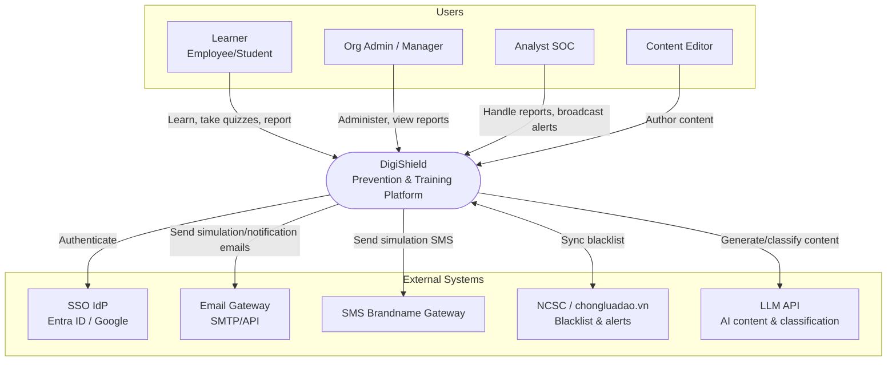

---

## 3. Component Diagram (Container/Component)

**Description:** "Opens up" the system into 4 layers. The **Client Layer** includes the Web App, Browser Extension, and Email Add-in (where the "Report phishing" button lives). Every request passes through the **API Gateway** (JWT authentication, rate-limiting, routing) to **7 microservices** separated by business domain. Heavy tasks (bulk email/SMS sending, AI jobs) are pushed to the **Async Layer** (Message Queue + Workers + Scheduler) so they don't block requests. The **Data Layer** comprises PostgreSQL (business data), Redis (cache/queue), and Object Storage (media, reports). Note: only Simulation, Notification, and AI Service emit jobs to the queue.

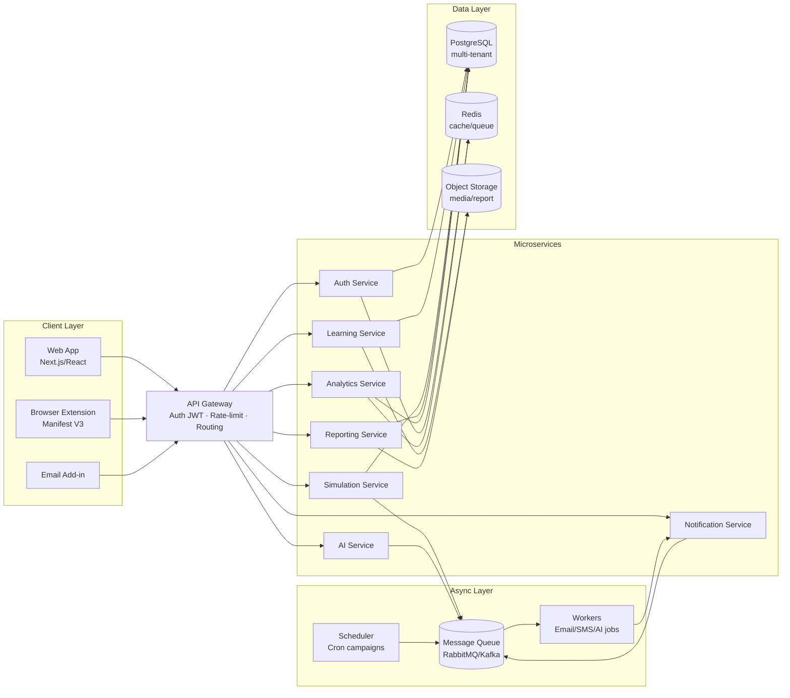

---

## 4. Deployment Diagram

**Description:** How the system actually runs on infrastructure. Traffic comes in via the **CDN/WAF** (attack protection, static distribution) → **Load Balancer** (TLS termination) → **Ingress** of the **Kubernetes** cluster, where the pods (API Gateway, services, workers) scale with load. The **Stateful/Managed** tier (PostgreSQL primary+replica, Redis, message broker, object storage) is separated from the pods for data durability. The **Observability** tier collects logs, metrics, and tracing. The same topology can be deployed **on-premise** for government agencies that must keep data in-country.

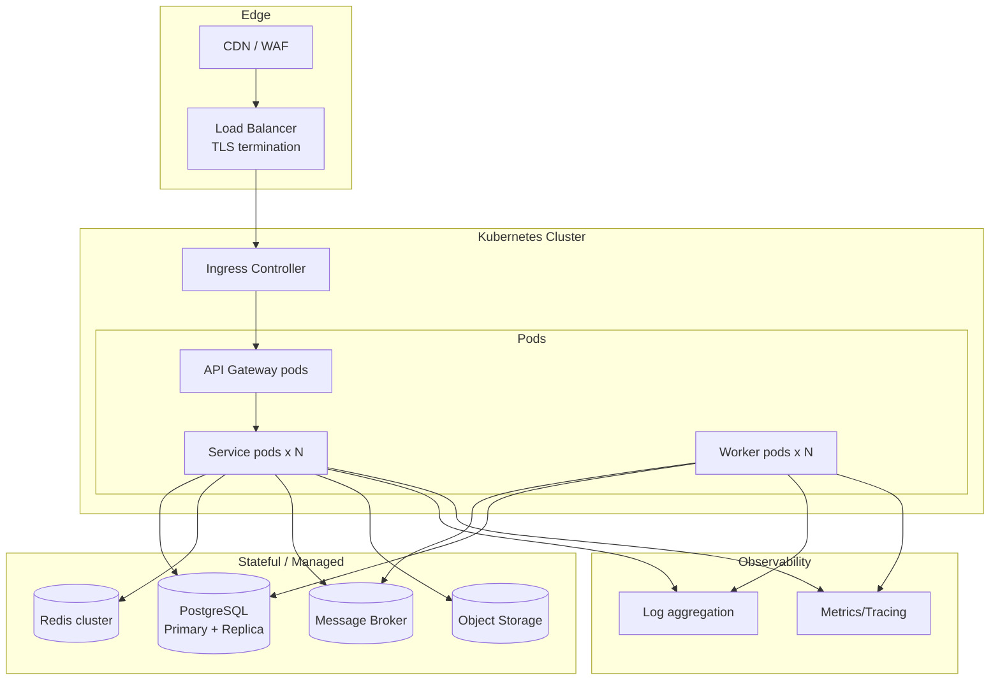

> **On-premise:** same topology but deployed within the government agency's internal infrastructure, with data stored in-country, independent of external cloud.

---

## 5. Data Model (ER Diagram)

**Description:** Entity-relationship diagram of the core tables. At the center is `ORGANIZATIONS` (tenant) — nearly every business table has an `org_id` to isolate data between organizations. The main clusters: *user management* (organizations, users, departments, groups), *learning* (courses → lessons → quizzes, enrollments), *simulation* (sim_templates → sim_campaigns → sim_events), *reporting & alerting* (reports, alerts, blacklist_entries), and *measurement/audit* (risk_scores, audit_logs). Notation: `||--o{` = one-to-many, `}o--o{` = many-to-many (e.g., users ↔ groups). Each block lists representative fields along with primary key (PK)/foreign key (FK).

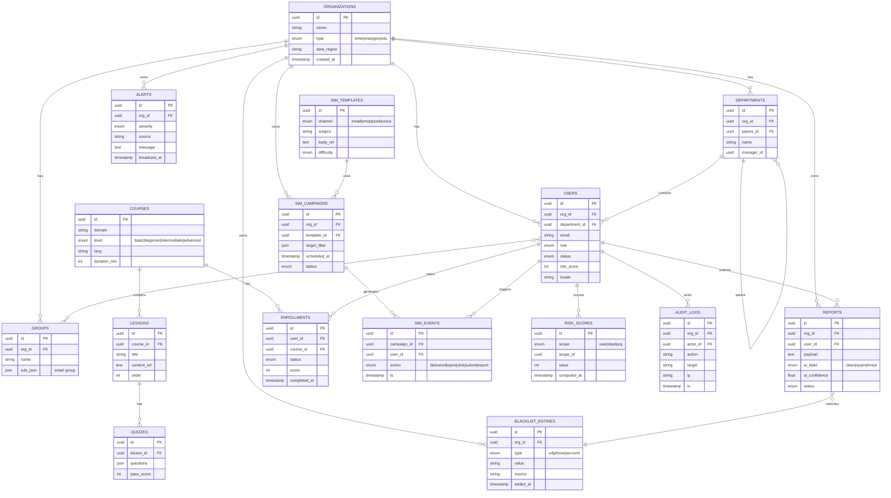

---

## 6. Sequence Diagrams (Business Flows)

### 6.1. SSO Login (SAML/OAuth)

**Description:** Single sign-on (SSO) login flow for enterprise/government. The user is redirected by the Auth Service to the identity provider (IdP) for authentication; when the IdP returns a valid assertion, the system **automatically creates/syncs the account and assigns the role**, then issues a JWT pair (access + refresh). Points to note when coding: mapping IdP attributes → role and handling first-time login users (just-in-time provisioning).

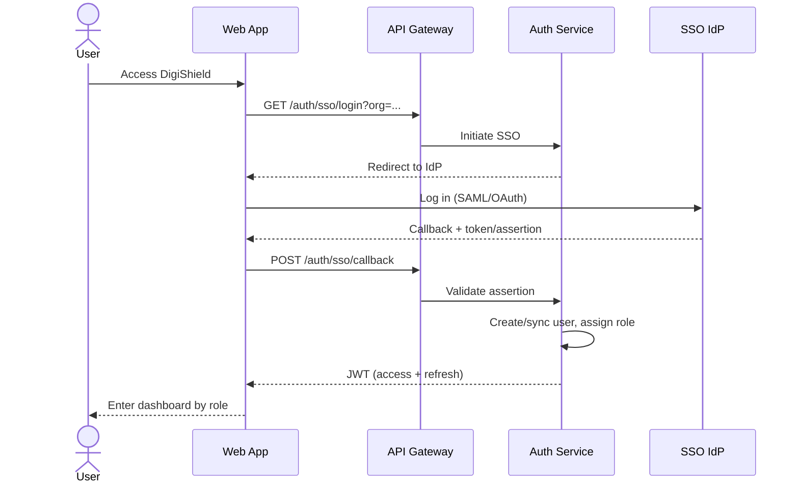

### 6.2. Phishing Simulation Campaign + Click Tracking + Just-in-time Coaching

**Description:** The core flow of the Simulate module. The Manager creates a campaign → the Simulation Service pushes the email-sending job through the queue (asynchronous to handle high load). Each email embeds a **tracked link/pixel**: when a Learner *opens* or *clicks*, the tracking endpoint records a `sim_event`. The moment a click occurs, the system does two things in parallel: displays the **Just-in-time coaching page** (teaching right at the point of the mistake) and **updates the risk_score**. When coding, ensure tracking is idempotent and does not "punish" the user — the goal is to teach, not to catch mistakes.

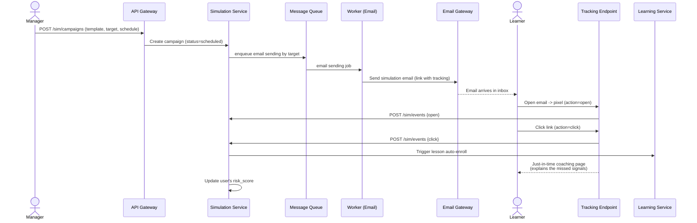

### 6.3. User Reports Phishing Email → AI Classifies → Blacklist Check → Alert Broadcast

**Description:** The "Report & Alert" flow. The Learner clicks the report button from the extension/add-in → the Reporting Service stores the report → the **AI Service classifies** it (clean/spam/threat + confidence) → checks against the **blacklist**. The `alt` block represents the decision branch: if confidence *exceeds the auto threshold*, the email is mass-quarantined immediately; if uncertain, it goes into the **triage queue** for an Analyst to decide. When confirmed as a real threat, the Notification Service **broadcasts a realtime alert** to the whole organization over WebSocket. This is the "collective intelligence" loop: one person reports, the whole organization is protected.

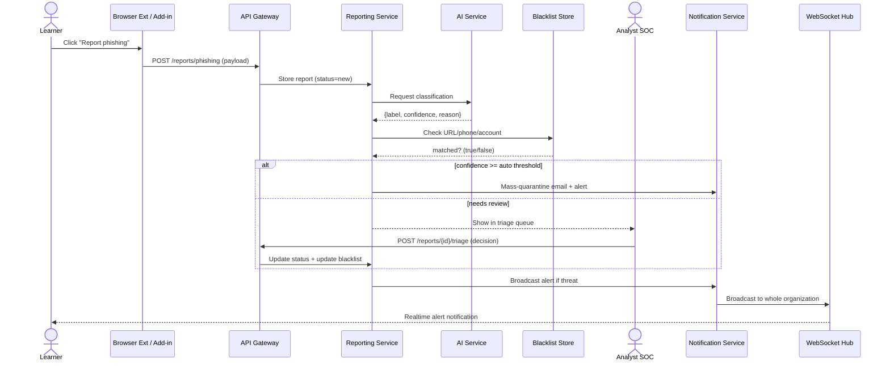

### 6.4. Adaptive Learning Framework – Risk-based Auto-enrollment

**Description:** The self-running "adaptive learning" mechanism. On schedule (Scheduler), the Analytics Service **recomputes the risk_score** from sim_events, quiz results, and reporting behavior, then hands it off to **AI Orchestration (AIDA)** to choose the appropriate course/level and **auto-enroll** the user. When the learner completes it, the progress flows back to Analytics to recompute risk — creating a continuous improvement loop. High-risk users are assigned more; strong users get a reduced load.

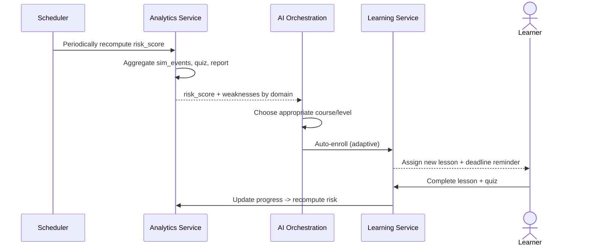

### 6.5. AI Generates Simulated Phishing Templates (with Moderation)

**Description:** How AI helps the Content Editor create templates quickly but safely. The Editor states a request (industry, season, channel) → the AI Service calls the LLM with a prompt *constrained to Vietnamese scenarios* → the draft must pass a **Moderation step** before final human approval. Only templates in the `approved` state can be used for campaigns. The Moderation step is a key control point to prevent AI-generated content from being misused or inappropriate.

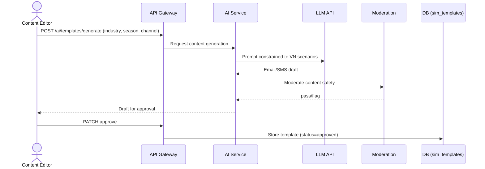

---

## 7. State Diagrams (Entity Lifecycles)

### 7.1. Phishing Report Lifecycle

**Description:** The states a report passes through, used to design the `status` field of the `reports` table and the transition logic. From `New` → AI classification; then it branches: high confidence goes to `AutoQuarantined`, the rest go to `InReview` for the Analyst to decide `Confirmed` (threat) or `Dismissed` (clean/spam). A confirmed threat goes to `Broadcasted` (alert broadcast) and then `Closed`. This diagram is the source of truth for validity checks on state transitions.

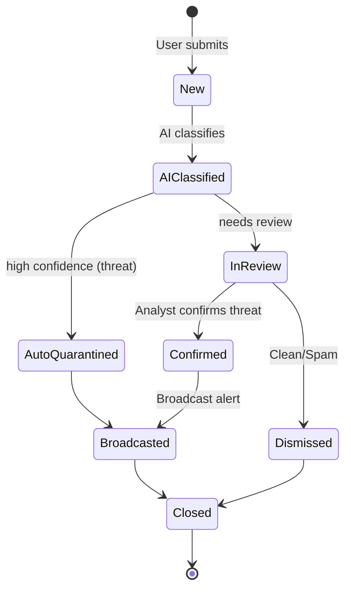

### 7.2. Simulation Campaign Lifecycle

**Description:** The states of a Simulate campaign, mapping directly to `sim_campaigns.status`. `Draft` → `Scheduled` (scheduled) → `Running` (sending) → `Collecting` (collecting events) → `Completed` → `Reported` (generate report + auto-enroll lessons for those who fell for the trap). It can be `Cancelled` from Draft/Scheduled. The diagram helps determine when editing/cancelling is allowed and when to open/close the event collection window.

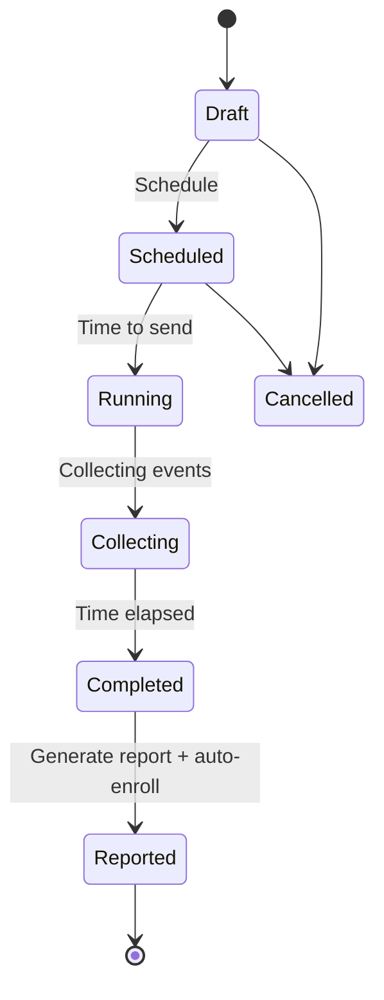

---

## 8. Flowchart – Risk Score Calculation

**Description:** The algorithm for calculating a user's risk score — the input for adaptive learning and smart grouping. The system takes 90 days of data (sim_events, quizzes/enrollments, reporting behavior), applies **weights**: adds points for simulation clicks/submits or for overdue lessons; subtracts points for correct reports or completed lessons. It aggregates & normalizes to a 0–100 scale, then thresholds: `≥70` high risk (reinforced auto-enroll), `40–69` monitor, `<40` maintain. The result is stored in `risk_scores`. This is the business specification for implementing the scoring function (weights/thresholds should be made configurable).

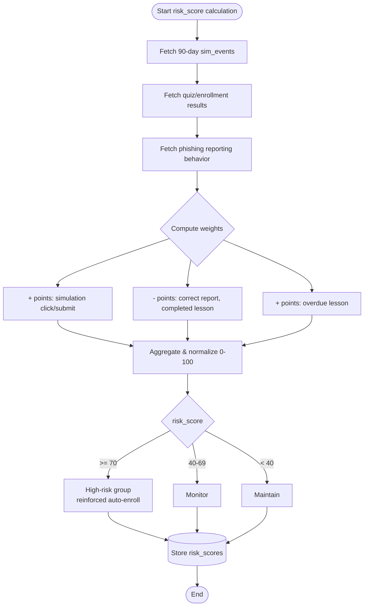

---

## 9. REST API Specification

The full machine-readable specification is in the file **`DigiShield_openapi.yaml`** (OpenAPI 3.0 — import into Swagger UI / Postman / generate client SDK). Summary of endpoint groups:

| Group | Representative Endpoint | Method | Description |
|------|--------------------|--------|-------|
| Auth | `/auth/login`, `/auth/sso/callback`, `/auth/refresh` | POST | Internal/SSO login, token refresh |
| Users | `/users`, `/users/{id}` | GET POST PATCH DELETE | User & role management |
| Groups | `/groups`, `/groups/{id}/evaluate` | GET POST | Smart group; re-evaluate members |
| Courses | `/courses`, `/lessons/{id}` | GET POST | Lesson library |
| Enrollments | `/enrollments`, `/enrollments/{id}` | GET POST PATCH | Enrollment & progress |
| Simulation | `/sim/campaigns`, `/sim/events` | GET POST | Simulation campaigns & events |
| Reports | `/reports/phishing`, `/reports/phishing/{id}/triage` | POST GET | Email reporting & triage |
| Alerts | `/alerts/broadcast` | POST | Broadcast alert (WebSocket push) |
| Blacklist | `/blacklist` | GET POST | Blacklist management & sync |
| Analytics | `/analytics/risk`, `/analytics/benchmark` | GET | Risk score, benchmarking |
| AI | `/ai/templates/generate`, `/ai/classify` | POST | Template generation, email classification |
| Export | `/reports/export` | POST | Export compliance report PDF |

**General conventions:**
- Base URL: `https://api.digishield.vn/api/v1`
- Auth: `Authorization: Bearer <JWT>`; scoped by `org_id` in the token.
- Pagination: `?page=&size=`; returns `X-Total-Count`.
- Errors: RFC 7807 standard (`application/problem+json`).
- Idempotency for the POST that creates campaigns: `Idempotency-Key` header.

---

## 10. Event Model (Event/Queue)

The main events flow through the Message Broker (suggested topics):

| Topic | Producer | Consumer | Main Payload |
|-------|----------|----------|---------------|
| `sim.dispatch` | Simulation | Email/SMS Worker | campaign_id, user_id, channel |
| `sim.event.recorded` | Tracking | Analytics | event(open/click/submit), ts |
| `report.submitted` | Reporting | AI Service | report_id, payload |
| `report.classified` | AI Service | Reporting, Notification | label, confidence |
| `alert.broadcast` | Notification | WebSocket Hub | severity, message |
| `risk.recompute` | Scheduler | Analytics | scope, scope_id |
| `enrollment.assigned` | AI Orchestration | Learning, Notification | user_id, course_id |

> Use a **dead-letter queue** for failed sending jobs; retry with backoff. Workers are **idempotent** by `event_id`.

---

## 11. Security & Non-functional Requirements

- **Authentication/Authorization:** short-lived JWT + refresh; RBAC with 6 roles (Super Admin, Org Admin, Manager, Content Editor, Analyst, Learner); scoped by tenant + department.
- **Encryption:** TLS 1.2+ in transit; at-rest encryption for sensitive data; secrets managed via a secrets manager.
- **Privacy:** do not publicly disclose the identity of individuals who "fell for the trap"; anonymous culture surveys; compliance with the Personal Data Protection Decree.
- **Audit:** every sensitive action is logged to `audit_logs` (actor, action, target, ip, ts).
- **Performance:** campaigns to tens of thousands of people sent via queue; dashboard < 2s; Redis cache for analytics.
- **Availability:** target uptime ≥ 99.5%; periodic backups; DR plan.
- **Data sovereignty:** option for in-country / on-premise storage for the government sector.
- **Observability:** centralized logging, metrics, distributed tracing.

---

## 12. 100% Specification Closure Supplement

This section supplements the missing/partial features to fully match the product specification: **gamification, knowledge & culture assessments, ThreatFlip, certificates, bulk import/SCIM, reminders, AI moderation, AI orchestration, coaching content, compliance policy**.

### 12.1. Supplementary Data Entities (Extended ER)

**Description:** The extended ER for advanced features, continuing the model in Section 5. It adds the clusters: *gamification* (badges, user_badges, points_ledger), *assessment* (assessments, assessment_responses — `user_id` nullable to support anonymous surveys), *certificates* (certificates), *notifications/reminders* (notifications), *ThreatFlip* (threat_intel that can be converted into a sim_template), *coaching* (coaching_pages attached to a template), and *compliance* (compliance_policies). These tables all have an `org_id` and integrate with the existing core tables.

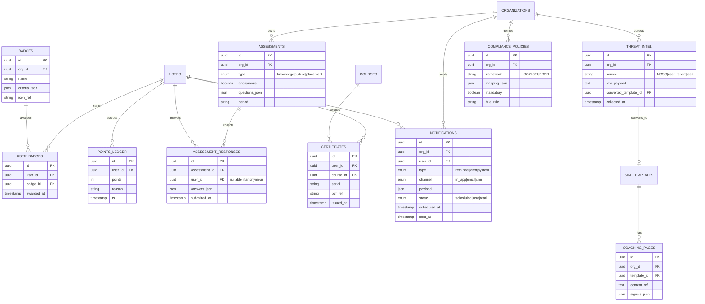

### 12.2. Supplementary Endpoint Groups

| Group | Endpoint | Method | Description |
|------|----------|--------|-------|
| Gamification | `/gamification/leaderboard` | GET | Leaderboard by period/unit |
| Gamification | `/users/{id}/badges` | GET | A user's badges |
| Gamification | `/users/{id}/points` | GET | Accrued points (points ledger) |
| Assessment | `/assessments` | GET POST | Create knowledge/culture/placement surveys |
| Assessment | `/assessments/{id}/responses` | POST | Submit responses (supports anonymous) |
| Assessment | `/assessments/{id}/results` | GET | Aggregated results (anonymized) |
| Assessment | `/assessments/placement` | POST | Adaptive placement assessment |
| Certificate | `/users/{id}/certificates` | GET | List of certificates |
| Certificate | `/certificates/{id}` | GET | Download certificate PDF |
| Provisioning | `/users/import` | POST | Bulk import (CSV/JSON) |
| Provisioning | `/scim/v2/Users` | GET POST PUT DELETE | SCIM 2.0 sync from IdP |
| Notification | `/notifications` | GET POST | List & create notifications |
| Notification | `/notifications/reminders` | POST | Schedule mandatory training reminders |
| ThreatFlip | `/threat-intel` | GET POST | Threat intel sources |
| ThreatFlip | `/threat-intel/{id}/convert` | POST | Convert real threat → template/lesson |
| ThreatFlip | `/reports/phishing/{id}/convert-to-training` | POST | "Flip" a reported email into training content |
| AI | `/ai/moderate` | POST | Moderate the safety of AI-generated content |
| AI | `/ai/orchestration/run` | POST | Run AIDA: recompute risk + auto-enroll |
| Coaching | `/coaching-pages` | GET POST | Manage just-in-time coaching content |
| Compliance | `/compliance/policies` | GET POST | Compliance policies & mapping |
| Compliance | `/compliance/status` | GET | Compliance status by unit/individual |

### 12.3. Sequence — Gamification (Awarding Points & Badges)

**Description:** An event-driven reward mechanism. When a reward-worthy event occurs (e.g., a correct report, a completed lesson) and is published to the queue, the **Gamification Service** applies the point rules, writes to the `points_ledger`, then checks the badge criteria. If met, it grants a `user_badge` and sends a notification + updates the leaderboard. The event-driven design decouples gamification from the core business and makes it easy to add new rules.

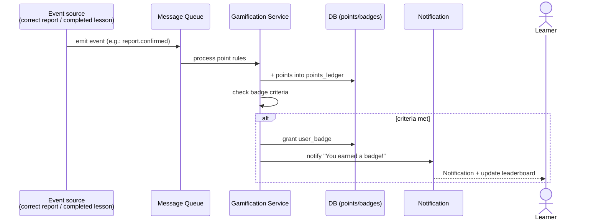

### 12.4. Sequence — ThreatFlip (Turn a Real Attack into a Lesson)

**Description:** The process of "flipping" a real (confirmed) attack email into training content. The Analyst selects a threat email → the ThreatIntel Service asks the AI to **de-identify** it (remove victims' personal information) and generate a simulation template + coaching page → it passes through **moderation** → and is stored as a draft pending approval. This keeps the training content closely aligned with the threats currently in play. Note the privacy compliance at the de-identification step.

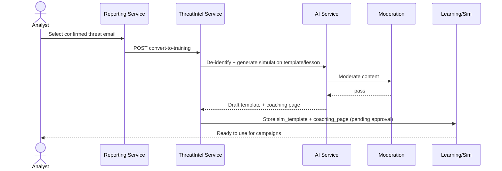

### 12.5. Sequence — Anonymous Culture Survey

**Description:** Measure "security culture" while still protecting identity. The Org Admin creates a survey with the flag `anonymous=true`; when a Learner submits responses, the system **does not store the user_id**. Analytics only aggregates by department, with no way to trace back to an individual. The crucial point when coding: separate the anonymous submission channel from identity at the API layer to ensure no linkage is leaked.

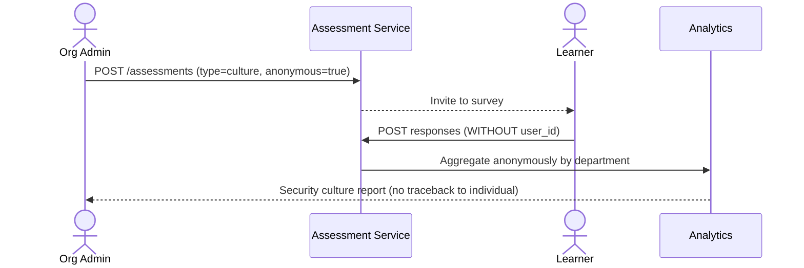

---

## 13. WebSocket Specification (Realtime)

The realtime channel for instant alerts & notifications.

- **Endpoint:** `wss://api.digishield.vn/ws?token=<JWT>`
- **Authentication:** JWT in query/handshake; bound to `org_id` to only receive events for the correct tenant.
- **Heartbeat:** ping/pong every 30s; auto-reconnect with backoff.

| Event (server → client) | Payload | Meaning |
|---|---|---|
| `alert.broadcast` | `{ severity, message, source, ts }` | Organization-wide alert |
| `notification.new` | `{ type, payload, ts }` | Personal notification (learning reminder, badge) |
| `campaign.update` | `{ campaign_id, status, stats }` | Campaign progress update (dashboard) |
| `report.status` | `{ report_id, status }` | Report status update for the Analyst |

| Message (client → server) | Payload | Meaning |
|---|---|---|
| `subscribe` | `{ channels: [] }` | Subscribe to channels (alerts, dashboard, etc.) |
| `ack` | `{ event_id }` | Acknowledge receipt of an alert |

---

## 14. Traceability Matrix

Maps **specification → API → screen** to track coverage (Yes = present after the supplement).

| # | Specified Feature | Main API | Screen | Coverage |
|---|---|---|---|---|
| 1 | Learn (lessons, quizzes) | `/courses` `/enrollments` | Library, Learner portal | Yes |
| 2 | Certificates | `/users/{id}/certificates` `/certificates/{id}` | Learner portal | Yes |
| 3 | Multi-channel Simulate | `/sim/campaigns` `/sim/events` | Create/Campaign results | Yes |
| 4 | Just-in-time coaching | `/coaching-pages` + tracking | Coaching page | Yes |
| 5 | Report & triage | `/reports/phishing` `/.../triage` | SOC handling inbox | Yes |
| 6 | Realtime alert | `/alerts/broadcast` + WebSocket | Alert center | Yes |
| 7 | Measure / risk | `/analytics/risk` `/analytics/benchmark` | Dashboard | Yes |
| 8 | AI orchestration (AIDA) | `/ai/orchestration/run` | Admin dashboard | Yes |
| 9 | AI template generation + moderation | `/ai/templates/generate` `/ai/moderate` | Content authoring | Yes |
| 10 | AI email classification | `/ai/classify` | SOC handling inbox | Yes |
| 11 | ThreatFlip | `/threat-intel/{id}/convert` | SOC inbox → Content authoring | Yes |
| 12 | Adaptive learning | `/assessments/placement` `/enrollments` | Learning library | Yes |
| 13 | Gamification | `/gamification/leaderboard` `/users/{id}/badges` | Learner portal | Yes |
| 14 | Knowledge & culture assessment | `/assessments` `/.../responses` `/.../results` | Survey | Yes |
| 15 | Smart Groups | `/groups` `/groups/{id}/evaluate` | Group management | Yes |
| 16 | Benchmark | `/analytics/benchmark` | Reports | Yes |
| 17 | Compliance & audit | `/compliance/policies` `/compliance/status` `/reports/export` | Reports & compliance | Yes |
| 18 | Bulk import / SCIM | `/users/import` `/scim/v2/Users` | User management | Yes |
| 19 | Reminders / notifications | `/notifications` `/notifications/reminders` | Learner portal | Yes |

> **Conclusion:** after the supplement, all 19/19 functional groups in the specification have a corresponding endpoint, data model, and screen — sufficient for end-to-end implementation.

---

## 15. v1.2 Supplement — Proactive Detection & OTT Channels

Adds 3 differentiating features for the Vietnamese context (referencing Hoxhunt/Cofense & the 2026 banking anti-fraud trends): **(1) Real-time scam interception**, **(2) Suspicious recipient account warning**, **(3) Simulation over Zalo/OTT**.

### 15.1. Expanding Simulation Channels (Zalo/OTT)

Expand the `channel` of `sim_templates` / `sim_events`: add `zalo`, `teams`, `slack` alongside `email|sms|qr|usb|voice`. Workers send via the respective APIs (Zalo OA, Microsoft Graph, Slack API). Tracking & coaching reuse the existing mechanism.

### 15.2. Supplementary Data Entities

**Description:** Two tables serving proactive detection. `ACCOUNT_WATCHLIST` stores suspicious recipient accounts/phone numbers/wallets along with a `risk_level` and source (SIMO/NAPAS/A05/user report) — for lookup at the money-transfer point. `INTERVENTION_EVENTS` records each time the system intervenes: the triggering signals (on a call, new payee, large amount, watchlist hit) and the decision (allow/warn/pause/block) for audit and analysis.

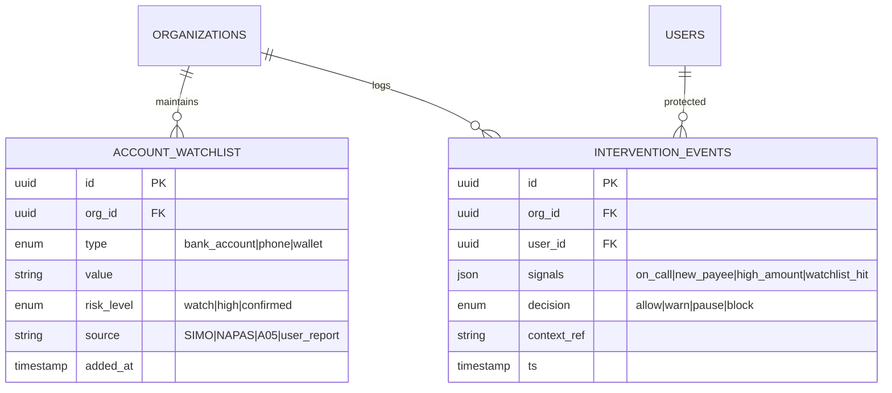

### 15.3. Supplementary Endpoints

| Group | Endpoint | Method | Description |
|------|----------|--------|-------|
| Interception | `/interventions/evaluate` | POST | Instant risk evaluation at the transaction point (returns allow/warn/pause/block) |
| Interception | `/interventions` | GET | Intervention log (for SOC/reporting) |
| Watchlist | `/account-watchlist` | GET POST | Manage & sync suspicious recipient accounts |
| Watchlist | `/account-watchlist/check` | GET | Quick lookup of an account/phone number at the money-transfer point |

> **Integration:** these endpoints are exposed via an **embedded SDK** (mobile/web) so banking apps, e-wallets, or internal apps can call them at the transfer confirmation step. DigiShield does not execute transactions — it only returns a warning decision.

### 15.4. Sequence — Real-time Scam Interception (active-call detection)

**Description:** The most differentiating feature for the Vietnamese context. At the transfer confirmation step, the app (via the embedded SDK) calls `/interventions/evaluate` with context: the amount, recipient account, *whether the user is currently on a call*, and whether the payee is new. The Intervention Service checks the **watchlist** and combines signals in the **Risk Engine** to reach a decision. If risk is high → it returns `pause` with an educational message ("Is someone instructing you to transfer money over the phone?"), helping the user stay alert against exactly the kind of impersonation scenario (e.g., posing as police). **Important:** DigiShield only *returns a warning decision* — it does not execute or block the transaction; the final decision rests with the banking app and the user. Every intervention is recorded as an `intervention_event`.

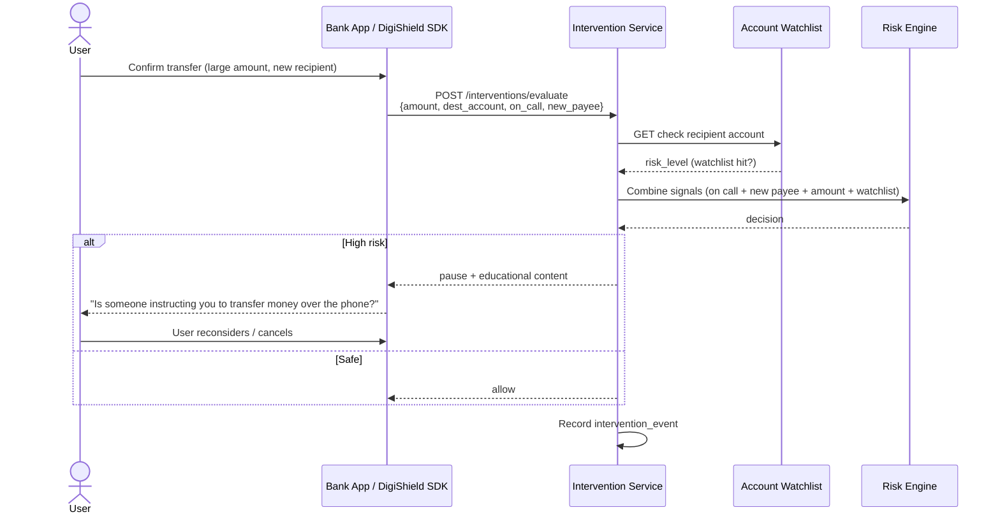

### 15.5. Traceability Matrix Update

| # | Feature | Main API | Coverage |
|---|---|---|---|
| 20 | Zalo/OTT simulation | `/sim/campaigns` (channel=zalo/teams/slack) | Yes |
| 21 | Real-time scam interception | `/interventions/evaluate` | Yes |
| 22 | Suspicious recipient account warning | `/account-watchlist` `/account-watchlist/check` | Yes |

> **Summary:** all 22/22 functional groups are now fully specified (data model + API + diagram).

---

## 16. Use Case Diagram (UML)

**Description:** A business-level view — *who* (actor) can do *what* (use case) with the system. Used to lock scope with the customer and for acceptance. Mermaid lacks standard UML use case notation, so the diagram below simulates it with a graph (actors as rectangles outside, use cases as rounded shapes inside the "DigiShield System" block); the table below is the full version.

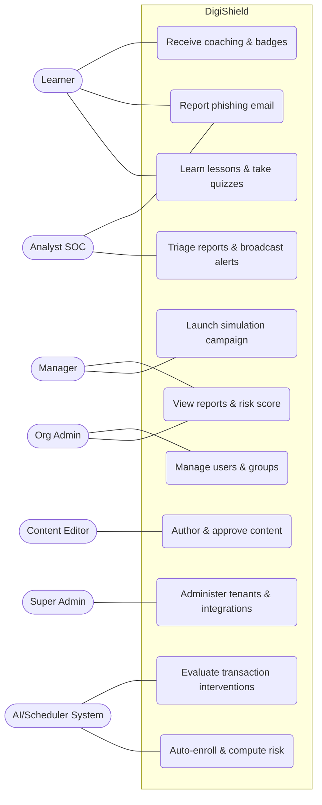

**Full use case table:**

| Actor | Main Use Cases |
|---|---|
| Learner | Learn lessons & quizzes · Report phishing email · Receive coaching/badges · Participate in surveys · Receive realtime alerts |
| Manager | Launch simulation campaigns · View department risk · Track training completion |
| Org Admin | Manage users/groups · Configure compliance policies · Import/SCIM · Export reports |
| Content Editor | Author lessons/simulation templates · Request AI content generation · Submit for moderation |
| Analyst SOC | Triage reports · Manage blacklist/watchlist · Broadcast organization-wide alerts · ThreatFlip |
| Super Admin | Administer tenants · Configure global integrations |
| System (AI/Scheduler) | Compute risk score · Adaptive auto-enroll · Evaluate transaction interventions · Award gamification |

---

## 17. BPMN Process Diagrams

**Description:** Three backbone business processes modeled in BPMN (multiple roles, decision gateways). The real BPMN 2.0 XML files are included (open with [bpmn.io](https://demo.bpmn.io) or Camunda Modeler):
- `DigiShield_bpmn_incident_response.bpmn` — Report handling & alert broadcast
- `DigiShield_bpmn_content_approval.bpmn` — AI content approval
- `DigiShield_bpmn_sim_campaign.bpmn` — Simulation campaign

Below is a quick-view (Mermaid) equivalent of each process.

### 17.1. Report Handling & Alert Broadcast (Incident Response)

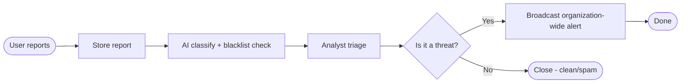

### 17.2. AI Content Approval (Content Approval)

```mermaid
flowchart LR
    S([Content generation request]) --> T1[AI generates content]
    T1 --> T2[Automatic moderation]
    T2 --> T3[Final approver]
    T3 --> G{Approve?}
    G -->|Pass| T4[Publish - approved]
    T4 --> E1([Ready to use])
    G -->|Fail| E2([Return for revision])
```

### 17.3. Simulation Campaign (Simulation Campaign)

```mermaid
flowchart LR
    S([Create campaign]) --> T1[Configure & schedule]
    T1 --> T2[Send simulation via queue]
    T2 --> T3[Collect open/click events]
    T3 --> G{Fell for the trap?}
    G -->|Yes| T4[Auto-enroll lesson + coaching]
    G -->|No| T5[Aggregate report]
    T4 --> T5
    T5 --> E([End])
```

---

## 18. Data Flow Diagram (DFD)

**Description:** A data flow diagram supporting privacy & security assessment (assisting a DPIA under the Personal Data Protection Decree). Notation: rectangle = *external entity*, rounded shape = *processing process*, cylinder = *data store*; labeled arrows are *data flows* (the type of data moving).

### 18.1. DFD Level 0 (context)

```mermaid
graph LR
    U[User]
    IDP[SSO IdP]
    NCSC[NCSC / Blacklist]
    LLM[LLM API]
    GW[Email/SMS Gateway]

    P((DigiShield<br/>System))

    U -->|Learning info, email reports| P
    P -->|Lessons, alerts, coaching| U
    IDP -->|Identity, attributes| P
    P <-->|Account/URL blacklist| NCSC
    P -->|De-identified content| LLM
    LLM -->|Classification content/labels| P
    P -->|Simulation email/SMS| GW
```

### 18.2. DFD Level 1 (main processes & data stores)

```mermaid
graph TB
    U[User]
    AN[Analyst]

    P1((1.0 Authentication & authorization))
    P2((2.0 Training & assessment))
    P3((3.0 Simulation & tracking))
    P4((4.0 Reporting & classification))
    P5((5.0 Analytics & risk))

    D1[(Users/RBAC)]
    D2[(Content & learning progress)]
    D3[(Simulation events)]
    D4[(Reports & blacklist)]
    D5[(Risk score & audit)]

    U -->|Log in| P1 --> D1
    U -->|Learn/quiz| P2 --> D2
    U -->|Interact with simulation email| P3 --> D3
    U -->|Submit suspicious email| P4 --> D4
    AN -->|Triage| P4
    P3 -->|Trap-falling behavior| P5
    P2 -->|Learning results| P5
    P4 -->|Threat label| P5
    P5 --> D5
    P5 -->|Auto-enroll| P2
```

> **Security/privacy note:** sensitive personal data is concentrated in D1, D4 (report payload), and D5 (audit). At-rest encryption, role-based access control, de-identification before sending to the LLM, and a separate anonymous channel for culture surveys (no user_id recorded) are required.

---

## 19. Multi-tenant SaaS Architecture

DigiShield serves many organizations (tenants) on the same platform. This chapter specifies how to **isolate, operate, and monetize** under a multi-tenant SaaS model — a decisive factor for scalability, security, and compliance.

### 19.1. Three Data Isolation Models

```mermaid
graph TB
    subgraph POOL["Pool — shared DB + shared schema"]
        direction LR
        PA[(1 DB · 1 schema)]
        PA --- PR["Separated by tenant_id + Row-Level Security"]
    end
    subgraph BRIDGE["Bridge — shared DB + separate schema"]
        direction LR
        BA[(1 DB)]
        BA --- BS1[schema_tenantA]
        BA --- BS2[schema_tenantB]
    end
    subgraph SILO["Silo — separate infrastructure/DB (or on-premise)"]
        direction LR
        SA[(DB tenant A)]
        SB[(DB tenant B)]
    end
```

| Model | Isolation | Cost/unit | Suitable for |
|---|---|---|---|
| **Pool** (RLS) | Logical (soft) | Lowest | Schools (very many users, low price) |
| **Bridge** (schema/tenant) | Medium | Medium | General enterprises |
| **Silo** (separate DB/infrastructure, on-prem) | Physical (strong) | High | Government agencies, large enterprises, data sovereignty requirements |

> Recommendation: **one codebase**, configurable across all three "deployment tiers". Default to Pool+RLS for new customers; upgrade to Bridge/Silo based on plan & compliance requirements.

### 19.2. Segment → Deployment Tier Matrix

| Segment | Default Tier | Data residency | Upgrade option |
|---|---|---|---|
| Schools | Pool (domestic cloud) | In-country | Bridge at large scale |
| Enterprises | Bridge (cloud) | In-country | Silo/BYOK for enterprise |
| Government Agencies | Silo / On-premise | Mandatory in-country | Air-gapped as required |

### 19.3. Enforcing Isolation at the Data Layer (RLS)

For the Pool model, do **not** rely solely on the application layer filtering by `tenant_id` — **PostgreSQL Row-Level Security** must be enabled so the DB itself blocks cross-tenant access:

```sql
ALTER TABLE reports ENABLE ROW LEVEL SECURITY;
CREATE POLICY tenant_isolation ON reports
  USING (tenant_id = current_setting('app.tenant_id')::uuid);
-- Each request sets: SET app.tenant_id = '<from JWT>';
```

- Every business table has a `tenant_id` column (= the current `org_id`), indexed.
- The DB connection uses a *non-superuser* role so that RLS takes effect.
- Mandatory test: an automated test suite verifies that "tenant A cannot read tenant B's data".

### 19.4. Propagating Tenant Context

```mermaid
sequenceDiagram
    participant C as Client
    participant GW as API Gateway
    participant MW as Tenant Middleware
    participant SVC as Service
    participant DB as PostgreSQL (RLS)

    C->>GW: Request + JWT (contains tenant_id)
    GW->>MW: Validate JWT, extract tenant_id
    MW->>MW: Create "tenant context" for the request
    MW->>SVC: Call service with context
    SVC->>DB: SET app.tenant_id = <tenant_id>; query
    DB-->>SVC: Return only the correct tenant's data (RLS)
```

The tenant context must be attached consistently at every storage layer:
- **Cache (Redis):** key prefix `t:{tenant_id}:...`.
- **Queue:** include `tenant_id` in the message; the worker sets the context when processing.
- **Object storage:** bucket/prefix by tenant.
- **Log/metrics/trace:** label with `tenant_id`.

### 19.5. Tenant Lifecycle

```mermaid
stateDiagram-v2
    [*] --> Provisioning: Register / create tenant
    Provisioning --> Configuring: Configure SSO/SCIM, branding
    Configuring --> Seeding: Seed default content (VN scenarios)
    Seeding --> Active: Activate
    Active --> Suspended: Overdue / violation
    Suspended --> Active: Restore
    Active --> Offboarding: Contract ends
    Offboarding --> Exported: Export data for customer
    Exported --> Purged: Delete per Personal Data Protection Decree
    Purged --> [*]
```

- **Offboarding** must support *exporting all data* and *permanent deletion* in accordance with the Personal Data Protection regulations.

### 19.6. Per-tenant Customization

| Item | How |
|---|---|
| Branding | Logo, colors, subdomain (`tenantA.digishield.vn`) |
| Content | Own lesson/template library + inherit the shared library |
| Policy | Risk thresholds, mandatory training, default language |
| Features | **Feature flags** by plan (enable/disable deepfake sim, ThreatFlip, intervention SDK, etc.) |

### 19.7. Resource Isolation & Anti "Noisy Neighbor"

- **Per-tenant rate-limit & quota** at the API Gateway (number of requests, number of campaigns, emails/month).
- **Queue partitioning** or fair weighting so that one tenant's bulk sending does not congest another tenant.
- **Metering** of every consumed resource (emails/SMS sent, AI calls, storage) for billing & over-limit alerting.

### 19.8. Security & Data Sovereignty

- **Data residency:** in-country storage; Silo/on-prem for government agencies.
- **BYOK (bring-your-own encryption key):** enterprise/gov manage their own keys; per-tenant encryption.
- **Per-tenant audit:** `audit_logs` filtered by `tenant_id`; tenant admins see only their own logs; Super Admin sees cross-tenant in a controlled manner.
- **Secret isolation:** secrets/SSO config separated per tenant in the secrets manager.

### 19.9. Billing & Metering

- Plans by segment: per-seat (enterprise), per-project/unit (government), per-student (schools).
- Tie **subscription + plan + feature flags**; metering (section 19.7) is the source for invoices & plan limits.

### 19.10. Supplementary Data Model for Multi-tenant

```mermaid
erDiagram
    TENANTS ||--o{ ORGANIZATIONS : maps
    TENANTS ||--|| SUBSCRIPTIONS : has
    PLANS ||--o{ SUBSCRIPTIONS : defines
    TENANTS ||--o{ FEATURE_FLAGS : toggles
    TENANTS ||--o{ TENANT_SETTINGS : configures
    TENANTS ||--o{ USAGE_METERING : meters

    TENANTS {
        uuid id PK
        string name
        enum tier "pool|bridge|silo"
        string data_region
        enum status "provisioning|active|suspended|offboarding"
    }
    PLANS {
        uuid id PK
        string name "edu|business|gov"
        json limits "seats, emails, ai_calls"
        json features
    }
    SUBSCRIPTIONS {
        uuid id PK
        uuid tenant_id FK
        uuid plan_id FK
        enum status "trial|active|past_due|canceled"
        date renews_at
    }
    FEATURE_FLAGS {
        uuid id PK
        uuid tenant_id FK
        string key
        boolean enabled
    }
    TENANT_SETTINGS {
        uuid id PK
        uuid tenant_id FK
        json branding
        json policy
        string default_locale
    }
    USAGE_METERING {
        uuid id PK
        uuid tenant_id FK
        string metric "email_sent|sms_sent|ai_call|storage"
        bigint value
        date period
    }
```

> Note: `tenant_id` replaces/is unified with `org_id` in the business tables in Sections 5 & 12. One `tenant` can map to one or more `organizations` (e.g., a corporation with multiple units).

---

*Document for development purposes. The KnowBe4 and Proofpoint feature/product names belong to their respective companies and are cited for reference only. The thresholds/timings are suggestions, to be adjusted to actual conditions.*
